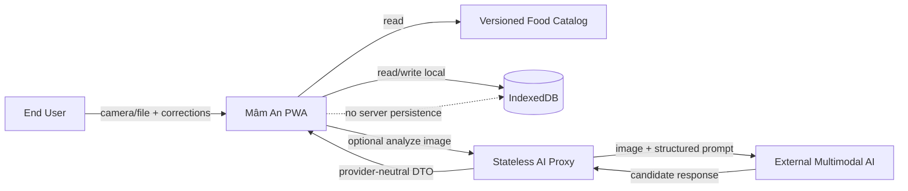
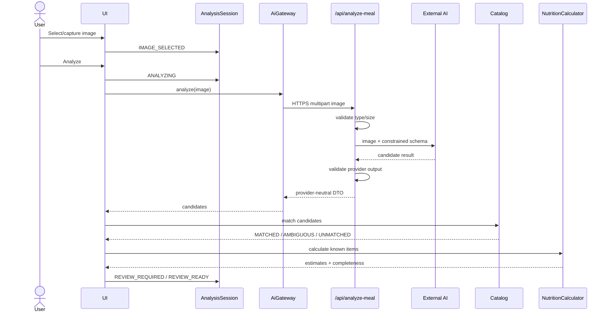

# High-Level Design — Mâm An Prototype v0.1

**Loại tài liệu:** System & Architecture Design — High-Level Design (HLD)  
**Trạng thái:** Proposed Architecture Baseline  
**Phạm vi:** Prototype tương tác phục vụ demo học phần; không phải production medical system  
**Nguồn yêu cầu:** `PRD_Mam_An_Prototype_v0.1.md`, `SRS_Mam_An_Prototype_v0.1.md`  
**Protocol thiết kế:** `TECTON_v1_Principal_Protocol.md`  
**Ngày chốt HLD:** 2026-09-19

---

## 0. Evidence state

- **[READ]** `TECTON_v1_Principal_Protocol.md:15-27,163-181,254-263,334-341` — HLD này đi theo objective-first, door classification, 3+1 branches, trade ledger, ADR/tripwire và evidence labels.
- **[READ]** `PRD_Mam_An_Prototype_v0.1.md:3-19,31-57,169-193,243-268,290-321` — mục tiêu là chứng minh trọn flow giá trị bằng một prototype mobile-first, local-first, có deterministic demo path và không vượt phạm vi y khoa.
- **[READ]** `SRS_Mam_An_Prototype_v0.1.md:113-156,855-1010,1161-1249` — architecture constraints, NFR, offline/degraded behavior và các quyết định cần architecture chốt.
- **[READ]** Vite official documentation — React/TypeScript template, static production build và quy tắc env client (`VITE_*` bị bundle vào client).
- **[READ]** Vercel official documentation — static deployment + Functions, Local/Preview/Production environments, Preview Deployment theo Git và Function request/response payload limit hiện tại.
- **[READ]** Dexie official documentation — TypeScript support, IndexedDB schema versioning và upgrade mechanism.
- **[READ]** OpenAI API official documentation — Responses API nhận image input; `store:false` có thể dùng để không lưu Response object để retrieve về sau; chính sách retention thực tế còn phụ thuộc data-control/account policy.
- **[UNKNOWN]** Chưa có repository implementation để kiểm tra runtime behavior, bundle size, browser compatibility thực tế, AI latency/cost trên ảnh món Việt, hay độ chính xác recognition.

> Evidence label trong tài liệu nói về mức chắc của **claim kiến trúc**, không phải mức ưu tiên requirement.

---

# 1. Objective function

## 1.1 Ba thuộc tính được tối ưu

1. **Demo determinism & failure tolerance.** UC-01 → UC-05 phải chạy được kể cả khi live AI/network thất bại; sample path là đường sống chính của buổi demo. **[READ: PRD §3, SRS NFR-03/§14]**
2. **Data correctness & transparency.** AI chỉ gợi ý; catalog + deterministic calculator mới là nguồn số carb/kcal; `UNKNOWN` không được biến thành `0`; lịch sử không tự đổi theo catalog mới. **[READ: SRS §13, §18A-C]**
3. **Time-to-market & team comprehensibility.** Kiến trúc phải đủ nhỏ để nhóm sinh viên có thể build, debug và demo; không dựng distributed system hoặc backend database cho nhu cầu chưa tồn tại. **[READ: PRD §2/§8, SRS §18G]**

## 1.2 Cố ý hy sinh

- Horizontal scale, multi-region và HA production-grade.
- Account, auth, cloud sync, server-side analytics và clinician portal.
- Production medical compliance program.
- Long-term server persistence của meal/glucose/image.
- Backend CMS cho food catalog.
- Kiến trúc microservices hoặc event-driven.

Những thứ trên bị bỏ **có chủ đích** vì không chứng minh proposition của prototype. **[READ: PRD out-of-scope; SRS §2.3]**

## 1.3 Non-negotiables / ruin gates

Không được ship architecture nếu có một trong các trạng thái sau:

- API secret nằm trong frontend bundle, browser storage hoặc Git repository.
- Backend/proxy persist meal/glucose history của user ở v0.1.
- Live AI là single point of failure của demo.
- AI raw output đi thẳng vào UI/domain storage mà không schema-validate/normalize.
- `UNKNOWN` bị tính như `0` hoặc AI bịa nutrition để lấp gap.
- Historical meal bị tính lại ngầm bằng catalog hiện tại.
- Code path chứa diagnosis, insulin dosing, medication recommendation hoặc causal inference meal → glucose.

**[READ: SRS TC-02/05/06/08/09/10/11/12; NFR-05/06/07]**

## 1.4 Working constraints

- **[ASSUMED]** Nhóm nhỏ, một codebase, thời gian triển khai ngắn; không có đội DevOps riêng.
- **[ASSUMED]** Web/PWA vẫn là delivery platform cho v0.1 như PRD/SRS baseline.
- **[ASSUMED]** Target chính là browser mobile hiện đại và laptop dùng để trình chiếu.
- **[ASSUMED]** Git-based workflow khả dụng; nếu không dùng GitHub/Vercel integration thì deployment contract giữ nguyên nhưng tooling thay đổi.
- **[UNKNOWN]** Deadline cụ thể, số dev và budget API chưa được cung cấp.

---

# 2. Architecture decision — summary

## 2.1 Chốt kiến trúc

**Chọn: Modular Monolith PWA, local-first trên browser + một stateless serverless AI proxy tùy chọn.**

```text
Browser / PWA
├─ React + TypeScript + Vite
├─ UI + feature modules
├─ Application/use-case layer
├─ Pure domain logic
│  ├─ nutrition calculator
│  ├─ completeness rules
│  ├─ weekly aggregation
│  └─ meal-analysis state machine
├─ Local adapters
│  ├─ Food Catalog (versioned static data)
│  └─ Repositories -> IndexedDB via Dexie
├─ AI Gateway -> /api/analyze-meal
└─ Service Worker -> app shell + demo assets only

Vercel
├─ Static frontend deployment
└─ Stateless Function: /api/analyze-meal
      └─ OpenAI Responses API (image-capable model, configured by env)
```

**Không có backend database. Không có auth. Không có server-side meal/glucose storage.**

## 2.2 Technology baseline

| Concern | Decision | Evidence / reason |
|---|---|---|
| Frontend | **React + TypeScript** | **[INFERRED]** Fit cho UI interaction/state-heavy prototype; ecosystem lớn; team skill chưa được xác nhận nên giữ framework boundary nông. |
| Build tool | **Vite** | **[READ]** Vite hỗ trợ React/TS template và static production build; phù hợp SPA/PWA nhỏ. |
| Architectural style | **Modular monolith** | **[INFERRED]** Một deployable client nhưng boundary rõ giữa domain/application/infrastructure; giảm ops/dependency tax. |
| Routing | **Client-side router** | **[INFERRED]** Cần các màn Analyze / History / Weekly / Settings nhưng không cần SSR. Exact router package là implementation detail. |
| Session state | **React `useReducer` + feature context** | **[INFERRED]** State machine đã rõ trong SRS; chưa cần Redux/Zustand. |
| Runtime schema validation | **Zod** | **[INFERRED]** Một schema dùng cho provider-neutral DTO + boundary validation; giảm raw untrusted AI data lọt vào domain. |
| Local DB | **IndexedDB qua Dexie** | **[READ]** SRS yêu cầu IndexedDB/abstraction; Dexie hỗ trợ TypeScript + schema version/upgrade; phù hợp snapshot/query. |
| Static catalog | **Versioned JSON/TS asset bundled với app** | **[READ]** PRD/SRS yêu cầu read-only versioned catalog, tách khỏi UI. |
| PWA | **Minimal service worker precache** | **[INFERRED]** Cache app shell + demo assets; không runtime-cache AI request/response hoặc health data. |
| Hosting | **Vercel** | **[READ]** Hỗ trợ static app + serverless Functions + Preview/Production environments trong cùng project. |
| AI proxy runtime | **Vercel Node Function** | **[READ]** Function chạy server-side, giữ secret khỏi client; không cần quản server. |
| Default AI provider | **OpenAI Responses API behind provider adapter** | **[READ]** API nhận image input. **[INFERRED]** Hợp với prototype; model ID là deployment config, không là domain dependency. |
| Tests | **Vitest + React Testing Library + Playwright** | **[INFERRED]** Unit/domain + component + end-to-end demo contract; exact tool versions không khóa ở HLD. |
| CI/CD | **GitHub Actions + Vercel Git deployment** | **[ASSUMED]** GitHub có sẵn; contract là tests trước merge + preview per change + production from `main`. |

### Vì sao không Next.js

**[INFERRED]** Prototype không cần SSR, server components, auth hay server data rendering. Chọn Next.js sẽ biến một SPA local-first thành full-stack framework trước khi có requirement tương ứng. Vite + một function proxy giữ surface nhỏ hơn.

### Vì sao không Flutter/React Native

**[READ]** PRD cho phép nhưng không yêu cầu native. **[INFERRED]** Web/PWA rẻ hơn để demo trên điện thoại lẫn laptop, không có device integration đặc thù, và giảm build/distribution friction.

---

# 3. Door classification

| Decision | Door | Verdict |
|---|---|---|
| React + Vite | Two-way | UI/domain boundary giữ logic framework-light; đổi Vue/Svelte tốn UI rewrite nhưng data/domain contract còn giữ được. |
| Modular monolith | Two-way | Có thể tách backend sau khi xuất hiện account/sync; hiện tại không trả distributed-system tax. |
| IndexedDB persisted schema | **One-way-ish** | Data đã lưu sống qua deploy; bắt buộc `schema_version`, migrations nhỏ và repository seam. |
| Food catalog format/version | **One-way-ish** | Historical snapshot tham chiếu version; format phải versioned từ ngày đầu. |
| OpenAI provider | Two-way by seam | Client chỉ biết `AiGateway`; provider logic nằm server-side adapter; model/provider có thể đổi. |
| Vercel hosting | Two-way | Static artifacts + standard HTTP function giữ portability chấp nhận được; không dùng proprietary DB/queue. |
| PWA caching policy | Two-way nhưng blast radius cao cho demo | Chỉ precache app shell/demo assets; AI endpoint network-only để tránh stale/fake success. |
| No backend DB | Two-way | Khi xuất hiện account/sync/backup requirement mới thêm backend store sau repository/API seam. |
| Medical-safety boundary | Non-negotiable | Không được “nới” chỉ vì demo; thay đổi này là product/regulatory decision, không phải refactor. |

---

# 4. Branch 3+1

## 4.1 Main branch — chosen architecture

**Client-heavy modular monolith + stateless AI proxy.**

### T0 — immediate effect

- Build nhanh, một frontend app, một optional function.
- Core flow vẫn chạy nếu proxy/AI tắt.
- Meal/glucose data ở browser; UI không cần backend CRUD.

### T1 — system/team response

- Domain logic có thể unit-test độc lập framework và provider.
- IndexedDB complexity bị cô lập trong repositories.
- AI provider drift chỉ ảnh hưởng adapter/normalizer boundary.
- Service worker cần test release riêng để không giữ asset cũ khi demo.

### T2 — equilibrium

**[INFERRED]** Future change dễ hơn ở đúng các joint đã biết: AI provider, persistence implementation, backend sync. Khi product cần account/cloud, có thể thêm API/backend mà không rewrite calculator/domain. Ngược lại, nếu prototype bị biến trực tiếp thành production medical app, architecture này sẽ thiếu compliance, auth, auditability và cloud recovery — lúc đó phải re-architect, không “scale bằng config”.

## 4.2 Pre-mortem — 18 tháng sau mọi người ghét kiến trúc này vì sao?

1. **Frontend thành “god app”**: feature imports chéo, UI gọi Dexie trực tiếp, domain phụ thuộc React.  
   **Countermeasure:** dependency rule + repositories/ports + import boundaries từ ngày đầu.

2. **Service worker gây demo stale version**: giảng viên thấy UI cũ sau deploy.  
   **Countermeasure:** minimal precache, visible build/version marker trong demo settings, smoke test incognito/clean-profile trước buổi demo.

3. **AI contract drift**: provider trả payload khác, candidate mapping vỡ.  
   **Countermeasure:** server output schema + client validation + fixture regression tests; live AI không nằm trên critical demo path.

4. **IndexedDB schema đổi làm mất/không đọc được history.**  
   **Countermeasure:** explicit DB version + migration tests + demo seed can reset only demo data; không silent clear-all.

5. **Food catalog “source_note” mơ hồ** dẫn đến số carb demo không truy vết được.  
   **Countermeasure:** catalog build/check step bắt buộc provenance field cho data dùng trong demo; nutrition sourcing là một architecture spike riêng.

6. **Real user data vô tình lọt vào logs/provider** khi nhóm dùng ảnh thật.  
   **Countermeasure:** logs chỉ event/error code; không raw image/health values; provider call `store:false`; demo ưu tiên sample image/data; policy account phải được verify trước khi dùng dữ liệu nhạy cảm thật.

## 4.3 Orthogonal branch — bỏ live AI khỏi critical build

Một phương án hoàn toàn khác nhưng hợp mục tiêu prototype là **deterministic recognition demo-only**:

- User chọn một trong ảnh sample bundled.
- App đọc precomputed `AnalysisResult` fixture.
- Toàn bộ correction → portion → calculation → save → glucose → weekly vẫn là real code.
- Live AI được build sau cùng như enhancement.

**Verdict:** Không chọn làm trải nghiệm duy nhất, nhưng **giữ như mandatory fallback path** vì PRD/SRS đã coi deterministic demo là P0. Đây là cách giảm risk mạnh nhất mà không làm giả core value loop.

## 4.4 Shadow review

### SRE/operator view

Điểm đau nhất không phải scale; là **buổi demo phụ thuộc network/provider/service worker cache**. Vì vậy uptime strategy = deterministic offline path, không phải multi-region backend.

### New-hire view

Điểm đau nhất là boundary mơ hồ giữa `MealDraft`, `AnalysisCandidate`, `FoodItem` và persisted `Meal`. HLD giữ bốn type riêng; cấm một “Meal” interface dùng cho mọi phase.

### Security reviewer view

Điểm đau nhất là raw image + API key. Secret chỉ server-side; image chỉ gửi khi user bấm Analyze; proxy stateless; logs không chứa image/glucose/meal payload.

### Finance owner view

Không có always-on server hoặc DB. Live AI được feature-flag/config và có demo fallback; cost chỉ phát sinh khi gọi analysis.

---

# 5. System context



### Trust boundaries

1. **Device input boundary:** camera/file picker, user text, glucose values.
2. **Browser persistence boundary:** IndexedDB contains health-adjacent local data.
3. **Network boundary:** only live analysis image/request leaves device; meal/glucose history does not.
4. **AI provider boundary:** all model output is hostile/untrusted until schema validation.
5. **Build/deploy boundary:** client env is public; server env may contain secrets.

---

# 6. Runtime topology & infrastructure

## 6.1 Runtime topology

```mermaid
flowchart TB
    subgraph Device[User Device]
      SPA[React SPA/PWA]
      SW[Service Worker]
      DB[(IndexedDB / Dexie)]
      FC[Food Catalog + Demo Fixtures]
      SPA <--> DB
      SPA --> FC
      SW --> SPA
    end

    subgraph Vercel[Vercel Project]
      CDN[Static Assets / CDN]
      FN[/api/analyze-meal\nNode Function]
    end

    subgraph External[External]
      OAI[OpenAI Responses API]
    end

    SPA -->|HTTPS| CDN
    SPA -->|HTTPS, only on Analyze| FN
    FN -->|HTTPS, store:false| OAI
    OAI --> FN
```

## 6.2 Infrastructure components

### Static frontend

- Vite production bundle served as static assets.
- No SSR; no server-side session.
- HTTPS required outside localhost.
- PWA service worker precaches only shell/static demo assets.

### AI proxy

Single endpoint: `POST /api/analyze-meal`.

Responsibilities:

1. reject wrong method/content type;
2. enforce input file type and application payload budget;
3. attach provider prompt/schema;
4. call external model with server-only key;
5. request machine-readable/structured output where provider supports it;
6. validate provider response server-side;
7. return provider-neutral analysis DTO;
8. map provider/network errors to stable internal error codes;
9. do **not** persist image, response, meal or glucose history;
10. do **not** log raw image or health payload.

### Payload budget

**[READ]** Vercel Functions currently documents a maximum request/response body payload of 4.5 MB.  
**Decision:** application-level upload budget **3 MB after client preprocessing** to leave headroom for multipart/metadata and future platform variance.  
**[INFERRED]** This is a safety margin, not an AI quality target. The resize dimensions/quality are chosen by spike using the actual demo image set.

### AI model config

- Provider: OpenAI by default.
- Endpoint family: Responses API.
- Model: server env/config, not hard-coded into domain.
- Request: image + constrained instruction returning only dish/component candidates and optional portion hint; **no nutrition total is authoritative from AI**.
- Set `store:false` on the provider request.
- **[UNKNOWN]** Account-specific abuse monitoring/data retention settings and eligibility; must be verified before using real sensitive images.

## 6.3 No additional infrastructure in v0.1

Explicitly **do not add**:

- SQL/NoSQL database;
- Redis/cache server;
- message queue;
- object storage for user images;
- auth provider;
- API gateway separate from deployment platform;
- container orchestration;
- background workers;
- analytics warehouse.

---

# 7. Environment design

## 7.1 Local development

Purpose: fast feature work and deterministic tests.

- Vite dev server for client.
- `vercel dev` only when testing the serverless proxy integration.
- Default developer flow can run with live AI **off** and fixtures/sample data on.
- `.env.local` is ignored by Git.
- Server secret exists only in server runtime env.

**Proposed public client config** — public by definition:

```text
VITE_APP_ENV=local|preview|demo
VITE_ENABLE_LIVE_AI=true|false
VITE_BUILD_ID=<non-secret build marker>
```

**Proposed server-only config:**

```text
OPENAI_API_KEY=<secret>
AI_MODEL=<image-capable model id>
AI_PROVIDER=openai
```

**[READ]** Vite exposes `VITE_*` variables into the client bundle, therefore no secret may ever use that prefix.

## 7.2 Preview

Purpose: QA trên real hosting/runtime trước merge.

- Mỗi PR/branch có Preview Deployment.
- Preview dùng separate env values from demo production.
- Live AI có thể bật bằng preview key/quota riêng.
- E2E smoke test chạy trên preview URL cho core demo path.

## 7.3 Demo / production deployment

Ở v0.1, “production” nghĩa là **stable demo deployment**, không phải clinical production.

- `main` → stable deployment/domain.
- Live AI enabled nếu provider spike pass.
- Demo/sample path bundled và luôn usable dù live AI fail.
- Trước buổi demo: test bằng fresh browser profile + offline mode.
- Rollback = promote/revert previous known-good deployment; không có database migration rollback vì không có server DB.

---

# 8. Module decomposition

## 8.1 Dependency rule

```text
Presentation / Feature UI
        ↓
Application Use Cases
        ↓
Domain Core
        ↑
Ports / Interfaces
        ↑
Infrastructure Adapters
```

**Rule:** Domain không import React, Dexie, Vercel SDK hoặc OpenAI SDK.

## 8.2 Proposed module map

```text
src/
├─ app/
│  ├─ AppShell
│  ├─ routes
│  ├─ providers
│  └─ config
│
├─ domain/
│  ├─ food/
│  │  ├─ FoodItem
│  │  └─ CatalogMatch
│  ├─ meal/
│  │  ├─ MealDraft
│  │  ├─ Meal
│  │  ├─ MealDraftItem
│  │  ├─ analysisStateMachine
│  │  ├─ nutritionCalculator
│  │  └─ completenessRules
│  ├─ glucose/
│  │  └─ GlucoseReading
│  └─ summary/
│     └─ weeklyAggregator
│
├─ application/
│  ├─ analyzeMeal
│  ├─ correctMealDraft
│  ├─ saveMeal
│  ├─ addGlucoseReading
│  ├─ getHistory
│  ├─ getWeeklySummary
│  └─ resetDemoData
│
├─ features/
│  ├─ meal-analysis/
│  ├─ meal-review/
│  ├─ history/
│  ├─ glucose-entry/
│  ├─ weekly-summary/
│  ├─ demo/
│  └─ settings/
│
├─ ports/
│  ├─ AiGateway
│  ├─ FoodCatalog
│  ├─ MealRepository
│  ├─ GlucoseRepository
│  ├─ SettingsRepository
│  └─ Logger
│
├─ infrastructure/
│  ├─ ai/
│  │  ├─ HttpAiGateway
│  │  ├─ analysisDtoSchema
│  │  └─ errorMapping
│  ├─ persistence/
│  │  ├─ db
│  │  ├─ DexieMealRepository
│  │  ├─ DexieGlucoseRepository
│  │  └─ DexieSettingsRepository
│  ├─ catalog/
│  │  ├─ catalog.v1.json
│  │  └─ StaticFoodCatalog
│  ├─ demo/
│  │  ├─ demoMeals.json
│  │  ├─ demoGlucose.json
│  │  ├─ sampleAnalysis.json
│  │  └─ sampleImages/
│  └─ logging/
│     └─ SafeConsoleLogger
│
└─ shared/
   ├─ errors
   ├─ ids
   ├─ dates
   └─ validation

api/
└─ analyze-meal.ts
```

## 8.3 Module responsibilities

### `domain/meal`

Pure business rules only:

- analysis session states from SRS;
- portion > 0 invariant;
- deterministic `carb_per_serving × portion_multiplier`;
- `UNKNOWN`/`PARTIAL` propagation;
- build immutable persisted snapshot.

### `application`

Orchestrates use cases. It can depend on ports but not concrete adapters.

Example conceptual flow:

```text
analyzeMeal(image)
  -> AiGateway.analyze(image)
  -> validate/normalize candidates
  -> FoodCatalog match
  -> build MealDraft
  -> calculate known items
  -> return REVIEW_REQUIRED / REVIEW_READY
```

### `features`

Own UI screens/components and user interaction state. Feature code does not query IndexedDB tables directly.

### `ports`

Contracts that keep one-way decisions reversible.

### `infrastructure`

Provider/framework-specific code. This is the only layer allowed to know Dexie, `/api/analyze-meal`, static JSON layout and logging implementation.

---

# 9. Data architecture

## 9.1 Source-of-truth matrix

| Data | Source of truth | Persisted? |
|---|---|---|
| Food nutrition | Versioned bundled catalog | App asset |
| Current analysis | `MealDraft` session state | No |
| Saved meal | Meal snapshot in IndexedDB | Yes |
| Glucose reading | IndexedDB | Yes |
| Weekly summary | Derived at query time | No |
| AI raw/provider response | Transient | No |
| Original image | Transient by default | No |
| Demo fixtures | Bundled static assets | Yes, as app assets |

**[READ: SRS §13]**

## 9.2 IndexedDB stores

Use one database, proposed name `mam-an`.

### `meals`

Primary key: `id`.

Useful indexes:

- `created_at`
- `is_demo`

Record is persisted snapshot, including `catalog_version` and item estimates at save time.

### `glucoseReadings`

Primary key: `id`.

Useful indexes:

- `measured_at`
- `meal_id`
- `is_demo`

### `settings`

Single-record/keyed settings store.

### `meta`

Contains non-health metadata such as:

- `schema_version`
- `demo_seed_version`

No raw AI response store. No image blob store in P0.

## 9.3 Schema versioning

- Dexie DB version starts explicit at first implementation.
- Every persisted-model change either:
  1. is backward-compatible read; or
  2. adds an explicit migration.
- A migration may transform app-local records but may never silently convert `null/UNKNOWN` to `0`.
- Demo reset only deletes/reseeds records with `is_demo=true`.

## 9.4 Food catalog

Proposed structure:

```text
catalog/
├─ manifest.json
└─ foods.vi.v1.json
```

Manifest conceptually includes:

```text
catalog_version
published_at
source_set
schema_version
```

Each item preserves `source_note`/provenance field required by SRS. Nutrition sourcing itself is not solved by HLD; see Spike A-02.

---

# 10. Core runtime flows

## 10.1 Live meal analysis



Failure at any network/provider step maps to `ANALYSIS_ERROR`; image preview/session remains available.

## 10.2 Manual fallback

```text
ANALYSIS_ERROR or UNMATCHED
  -> search catalog / custom name
  -> set portion
  -> deterministic calculator if nutrition known
  -> UNKNOWN/PARTIAL otherwise
  -> review
```

No dead-end.

## 10.3 Save meal

```text
MealDraft
  -> domain validation
  -> SnapshotBuilder
  -> MealRepository.save
  -> IndexedDB transaction
  -> repository read-back / history query
```

Save failure preserves draft.

## 10.4 Weekly summary

```text
local date
  -> compute last 7 calendar days
  -> MealRepository.list(range)
  -> GlucoseRepository.list(range)
  -> WeeklyAggregator
  -> view model
```

Summary is never persisted as authoritative data.

## 10.5 Demo seed/reset

```text
bundled fixtures
  -> DemoSeedService
  -> tag is_demo=true
  -> same repositories as user data
  -> same history/weekly read path
```

The demo does not have a fake parallel UI implementation.

---

# 11. PWA / offline design

## 11.1 Caching strategy

Cache:

- HTML/app shell;
- JS/CSS bundles;
- icons/manifest;
- curated demo images;
- catalog/demo fixture assets.

Do **not** cache:

- `/api/analyze-meal` response;
- AI provider traffic;
- raw user images;
- meal/glucose API calls — there are none.

## 11.2 Behavior when offline

Still works:

- app shell if previously installed/cached;
- demo/sample analysis;
- catalog/manual flow;
- portion calculation;
- save/read local meal;
- add glucose;
- history;
- weekly summary.

Does not work:

- live AI analysis.

UI exposes this as `NETWORK_UNAVAILABLE`, never as fake success.

## 11.3 Service-worker safety

Because stale SW is a demo risk:

- keep policy minimal;
- no complex runtime caching rules in v0.1;
- expose a non-sensitive build ID in debug/about screen;
- add pre-demo fresh-profile smoke test.

---

# 12. Security & privacy design

## 12.1 Secret handling

- `OPENAI_API_KEY` only in server environment.
- Never prefix secrets with `VITE_`.
- `.env.local` excluded from Git.
- Client calls only own `/api/analyze-meal` endpoint.

## 12.2 Input validation

### Client boundary

- image MIME/type check;
- technical glucose validation (`number > 0`, supported unit, valid timestamp);
- portion > 0;
- user text rendered as text, not executable HTML.

### Proxy boundary

- method/content-type validation;
- image size budget;
- provider response schema validation;
- stable internal errors only; no raw upstream stack/errors to UI.

### AI boundary

Model output is data, never instruction. Nutrition values from model are ignored as source-of-truth.

## 12.3 Data minimization

- No account/name/email/phone.
- Meal/glucose remain local.
- Original image transient.
- Proxy has no DB.
- `store:false` on OpenAI response.
- Logs contain request lifecycle/error category only.

## 12.4 Provider retention warning

**[READ]** OpenAI API exposes data-control settings and image inputs have specific safety/retention exceptions.  
**[UNKNOWN]** Actual project/account retention configuration for the team.  
**Decision:** until this is verified, demo uses curated/sample images or non-sensitive photos; do not treat the prototype as a channel for sensitive real patient data.

---

# 13. Observability

Prototype observability is intentionally small.

## 13.1 Client logs

Development/preview only, event style:

```text
analysis.started
analysis.completed
analysis.failed(error_code)
analysis.match_state(counts)
storage.write_failed(entity_type)
demo.seeded(version)
demo.reset(version)
```

Never log:

- raw image/base64;
- glucose value;
- meal note text;
- full AI payload;
- API keys.

## 13.2 Server logs

Allowed:

- generated request ID;
- start/end;
- duration;
- provider status class;
- internal error code;
- payload byte size bucket if needed for debugging.

Not allowed:

- image content;
- prompt content containing user payload beyond fixed system template;
- model raw output;
- secret.

## 13.3 No production APM requirement

Sentry/OpenTelemetry/centralized analytics are not required in v0.1. Add only if repeated debugging pain justifies the dependency.

---

# 14. CI/CD & release design

## 14.1 Pull-request gate

Before merge:

1. typecheck;
2. lint;
3. unit tests;
4. component/integration tests;
5. production build;
6. preview deployment;
7. E2E smoke for deterministic demo path.

Live-AI E2E is **not** a merge blocker because external-provider flakiness must not make the codebase red. It runs as optional/integration smoke with explicit status.

## 14.2 Production/demo release gate

Required before demo deployment is called “known-good”:

- UC-01 → UC-05 deterministic path passes;
- offline demo path passes with network disabled;
- storage round-trip passes;
- seed/reset passes;
- safety-copy audit passes;
- no secret found in client bundle/config;
- preview verified on target mobile viewport;
- fresh browser profile loads current build.

## 14.3 Rollback

Server side has no persistent state, so rollback is artifact/deployment rollback. Local IndexedDB data persists across frontend rollback; therefore persisted schema changes must remain backward-aware or migration-tested.

---

# 15. Testing architecture

## 15.1 Pure unit tests

Must cover at minimum:

- nutrition calculator;
- portion validation;
- completeness (`COMPLETE/PARTIAL/UNKNOWN`);
- weekly 7-day window around timezone/day boundaries;
- persisted snapshot builder;
- catalog matching classification;
- AI DTO schema parsing;
- state-machine valid/invalid transitions.

## 15.2 Repository integration tests

Run against browser IndexedDB implementation/test browser:

- save → read round-trip;
- failed write does not create half record;
- range query order;
- linked glucose lookup;
- demo reset does not delete user-created rows;
- migration fixture from previous schema version.

## 15.3 Component tests

- loading/error/retry;
- correction does not get overwritten;
- unknown item visibly marks total partial;
- glucose form does not render medical classification;
- history empty state is not fake data.

## 15.4 End-to-end contracts

At least:

1. sample image → review → portion change → save;
2. history sees saved meal without reload requirement;
3. add glucose linked to meal;
4. weekly summary derives from saved data;
5. network disabled → sample/manual path still completes;
6. seed reset returns exact baseline.

---

# 16. Image preprocessing spike

The proxy platform body limit creates a concrete architecture constraint, but image quality vs recognition accuracy cannot be decided from docs alone.

## Hypothesis

**[INFERRED]** Client-side downscale/compression can keep typical meal photos under the app's 3 MB payload budget without materially hurting candidate recognition for the curated demo set.

## Falsifier

If compressed images cause materially more wrong/UNMATCHED results on the exact demo set than originals, move preprocessing to a different size/quality policy or change upload transport/platform. Do not “fix” recognition by increasing confidence language.

## Spike A-01

Dataset: every planned demo image + a few hard cases.  
Record: original bytes, compressed bytes, dimensions, provider result, match outcome, latency.  
Pass: all core demo images remain usable after compression and request stays below app budget.  
Fail: any core demo image becomes unreliable or exceeds transport budget.

No numeric accuracy percentage is claimed until this spike actually runs.

---

# 17. Food catalog provenance spike

## Problem

Architecture can version and preserve nutrition data, but it cannot manufacture trustworthy carb/kcal source data.

## Spike A-02

For every food used in the demo catalog, require:

- stable internal ID;
- serving label;
- carb/kcal value or `null`;
- source/provenance note;
- catalog version;
- documented mapping from source serving unit to app serving unit.

**Kill criterion:** if a food's value cannot be traced/normalized defensibly, keep it `UNKNOWN` or remove it from the core demo dataset. Never fill with a plausible number.

---

# 18. Trade ledger

| Gained | Lost / debt | Who pays | When bill arrives | Compounding direction |
|---|---|---|---|---|
| No backend DB/auth | No sync/backup/multi-device | Future MVP team | When multi-user appears | Positive now; migration later is explicit |
| Local-first IndexedDB | Browser storage quirks/migrations | Frontend team | Schema changes | Positive if repository/version discipline holds |
| Modular monolith | Not independently deployable modules | Same small team | Only if org/system grows | Positive for prototype comprehension |
| Vercel one-project infra | Some platform deployment coupling | Future infra owner | If platform cost/limits become issue | Moderate; portability preserved via HTTP/static seams |
| Serverless AI proxy | Cold-start/provider latency possible | User on live AI path | During analysis only | Limited because demo path bypasses it |
| OpenAI default provider | Vendor behavior/cost/retention dependency | AI integration owner | Provider/model changes | Bounded by adapter + config |
| Minimal PWA SW | Less sophisticated offline behavior | UX | If full offline product becomes goal | Positive: smaller stale-cache surface |
| No global state library | More explicit reducer/context wiring | Frontend team | If cross-feature state grows | Positive until complexity tripwire fires |
| Snapshot historical meals | Data duplication | Local storage | Long usage/history | Positive: preserves history correctness |
| No P0 image persistence | Less visual history richness | Demo UX | History screen | Positive for privacy/storage simplicity |

---

# 19. Architecture Decision Records

## ADR-001 — Modular monolith PWA

**Context:** Prototype cần mobile-first flow, local persistence, no backend DB, deterministic demo.  
**Options:** full-stack framework; SPA + separate backend; modular SPA + tiny proxy.  
**Decision:** React/Vite modular SPA/PWA + optional stateless proxy.  
**Consequences:** low ops and fast demo; not a production clinical architecture.  
**What would change this decision:** account/cloud sync becomes P0, substantial server-side domain logic appears, or native device integration becomes core.

## ADR-002 — IndexedDB via Dexie

**Context:** local data must survive reload and support range/history queries; schema must be versioned.  
**Options:** localStorage; native IndexedDB; Dexie wrapper.  
**Decision:** Dexie behind repositories.  
**Consequences:** one dependency added; much smaller persistence boilerplate; migration surface explicit.  
**What would change this decision:** data volume/query needs become trivial enough for simpler storage, or platform changes to React Native/Flutter.

## ADR-003 — AI suggestion, local nutrition authority

**Context:** user must correct AI and nutrition must be deterministic/explainable.  
**Options:** AI returns final carb; hybrid; catalog calculator.  
**Decision:** AI identifies/suggests only; catalog + calculator owns nutrition.  
**Consequences:** unmatched foods may be PARTIAL; no fabricated precision.  
**What would change this decision:** a validated dedicated nutrition model/data source is introduced with explicit product approval and traceable outputs.

## ADR-004 — Stateless serverless proxy

**Context:** AI secret cannot be client-side; backend DB is out of scope.  
**Options:** direct browser API; long-running backend; serverless function.  
**Decision:** Vercel Node Function `/api/analyze-meal`.  
**Consequences:** platform payload/duration limits apply; no server state.  
**What would change this decision:** proxy acquires sustained workloads, background jobs, private networking or server persistence.

## ADR-005 — OpenAI as initial provider behind adapter

**Context:** Need image-capable multimodal API for live enhancement; live AI is not demo-critical.  
**Options:** OpenAI; another multimodal provider; no live AI.  
**Decision:** OpenAI Responses API as initial provider; model selected by env; `store:false`.  
**Consequences:** provider cost/latency/policy must be spiked; data-control setup must be checked.  
**What would change this decision:** demo-set quality is inadequate, latency/cost violates budget, retention policy is unacceptable, or another provider performs materially better under the same fixture set.

## ADR-006 — Minimal PWA caching

**Context:** Offline demo helpful, but stale cache can sabotage releases.  
**Options:** no service worker; aggressive offline-first caching; shell/demo precache only.  
**Decision:** precache shell/catalog/demo assets only; network-only live AI.  
**Consequences:** reliable offline demo, limited offline sophistication.  
**What would change this decision:** offline-first becomes actual product requirement beyond demo.

## ADR-007 — No persisted original image in P0

**Context:** image is useful for analysis but not required to prove history loop; privacy/storage surface matters.  
**Options:** persist full image; thumbnail; no image persistence.  
**Decision:** no original image persistence in P0; add thumbnail later only if UX value proves worth it.  
**Consequences:** history less visual, but simpler data/privacy model.  
**What would change this decision:** user testing shows image recall is required to understand history.

---

# 20. Tripwires

## Plan-level tripwires

### TW-01 — Live AI threatens demo reliability

- **Signal:** any planned demo flow cannot complete when AI/network is unavailable.
- **Window:** every milestone/release candidate.
- **Response:** block release; restore deterministic sample/manual path before adding more AI work.

### TW-02 — Domain boundary erosion

- **Signal:** UI imports Dexie/OpenAI SDK or calculator imports React.
- **Window:** every PR.
- **Response:** reject dependency direction; move access behind port/adapter.

### TW-03 — Local schema becomes unsafe

- **Signal:** a persisted field changes semantics/type without explicit DB version/migration or compatibility test.
- **Window:** any data-model PR.
- **Response:** stop feature merge; add schema migration/test first.

### TW-04 — Service-worker stale build

- **Signal:** fresh deployment URL/browser still serves mismatched build/catalog version during release smoke.
- **Window:** before demo/release.
- **Response:** disable/simplify SW caching before debugging UI/application state.

## Model-level tripwire

**Assumption:** “Browser-local modular monolith remains the right board because one device/user, no sync/auth, and demo is the target.”

- **Signal:** account/cloud sync/multi-device becomes P0, or more than one server-side domain feature becomes required.
- **Response:** stop adding server functions piecemeal; redraw architecture around a real backend/data ownership model.

---

# 21. Architecture readiness check against SRS §20

| Gate | HLD answer |
|---|---|
| UI không gọi provider bằng secret | **YES** — UI → own proxy; secret server-only. |
| Draft / persisted meal / catalog item / AI candidate tách nhau | **YES** — separate domain types/modules. |
| UNKNOWN/PARTIAL không thành 0 | **YES** — domain completeness rules. |
| UI không biết IndexedDB details | **YES** — repository ports + Dexie adapters. |
| Deterministic calculator độc lập AI | **YES** — pure domain module. |
| Demo mode dùng cùng read-path | **YES** — seed repositories; history/weekly unchanged. |
| Network/AI/storage failure path | **YES** — stable errors + fallback + draft preservation. |
| Historical snapshot | **YES** — persisted meal snapshot + catalog version. |
| Local-only health data | **YES** — meal/glucose in IndexedDB only. |
| UC-01 → UC-05 không cần backend DB | **YES** — proxy is optional and stateless. |

**[INFERRED] Architecture baseline is internally consistent with the SRS readiness gate.** This is design verification, not runtime verification; no implementation exists yet.

---

# 22. Simplicity gate — what was deliberately removed

Removed from the baseline because it does not prevent a named P0 failure:

- Next.js/SSR;
- Redux/Zustand;
- backend database;
- OAuth/auth;
- cloud image storage;
- microservices;
- event bus/queue;
- API gateway;
- container/Docker requirement;
- centralized APM;
- production CMS;
- persisted weekly-summary table;
- original image storage;
- live AI dependency for demo.

What remains exists because it prevents a named failure: incorrect nutrition, secret leakage, lost local data, AI outage, stale history, or demo nondeterminism.

---

# 23. Recommended implementation order from this HLD

1. **Walking skeleton:** sample fixture → review → portion → deterministic carb.
2. **Persistence:** meal repository + IndexedDB + history round-trip.
3. **Glucose:** local reading + optional meal link.
4. **Weekly:** 7-day derived aggregator.
5. **Demo seed/reset + offline shell.**
6. **Live AI proxy + schema validation + provider adapter.**
7. **Hardening:** error paths, safety-copy audit, mobile E2E, service-worker release smoke.

This order keeps a working system alive after milestone 1 and puts the external/non-deterministic dependency last.

---

# 24. Open items that HLD intentionally does not pretend to know

- **[UNKNOWN]** Exact nutrition source and licensing/provenance quality for Vietnamese foods.
- **[UNKNOWN]** Actual recognition quality/latency/cost of the selected OpenAI model on the team's demo images.
- **[UNKNOWN]** Team's OpenAI project retention/data-control configuration.
- **[UNKNOWN]** Exact target browser/device matrix beyond modern mobile/laptop baseline.
- **[UNKNOWN]** Whether P1 export should be print stylesheet, browser print-to-PDF or generated PDF; not architecture-critical for P0.
- **[UNKNOWN]** Whether thumbnail persistence is actually valuable; intentionally deferred.

---

# 25. Assumption ledger

1. **[ASSUMED]** Web/PWA remains the platform for v0.1.  
   **Cheapest verification:** team explicitly confirms before scaffolding repo.
2. **[ASSUMED]** Small team / short prototype horizon makes single-repo modular monolith preferable.  
   **Cheapest verification:** confirm dev count/deadline; if there is a large existing platform, revisit ADR-001.
3. **[ASSUMED]** Vercel is acceptable as hosting/proxy platform.  
   **Cheapest verification:** create one empty Vite preview + one `/api/health` function before implementation.
4. **[ASSUMED]** GitHub workflow is available.  
   **Cheapest verification:** inspect actual repository host; swap CI provider without changing architecture if needed.
5. **[ASSUMED]** 3 MB client image budget is sufficient for curated meal images.  
   **Cheapest verification:** run Spike A-01 on the real demo image set.
6. **[ASSUMED]** OpenAI is an acceptable initial provider.  
   **Cheapest verification:** provider spike on the exact curated images plus retention/cost review; adapter keeps this reversible.

---

# 26. External facts checked for this architecture

As of **2026-09-19**, official documentation was checked for these load-bearing facts:

- Vite: static production build, React/TypeScript scaffolding, and client exposure of `VITE_*` environment variables.
- Vercel: Node Functions, Preview/Production environments and Git previews; Function payload limit relevant to image upload.
- Dexie: TypeScript support and explicit IndexedDB schema version/upgrade mechanism.
- OpenAI API: image input through Responses API; model selection is configurable; `store:false` supported; exact retention depends on data controls/policy context.

These external facts should be rechecked when implementation begins if the stack is upgraded or the project stalls for a long period.

