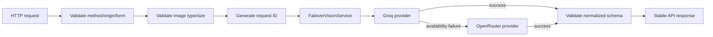

# Low-Level Design — Mâm An Prototype v0.1

**Loại tài liệu:** System & Architecture Design — Low-Level Design (LLD)  
**Trạng thái:** Implementation Baseline  
**Phạm vi:** Prototype tương tác phục vụ demo học phần; mobile-first Web/PWA; không phải hệ thống y khoa production  
**Nguồn thiết kế:** `PRD_Mam_An_Prototype_v0.1.md`, `SRS_Mam_An_Prototype_v0.1.md`, `HLD_Mam_An_Prototype_v0.1.md`  
**Protocol:** `TECTON_v1_Principal_Protocol.md`  
**Ngày:** 2026-09-19

---

# 0. Evidence state, scope và các delta so với HLD

## 0.1 Evidence grades

- **[READ]** `TECTON_v1_Principal_Protocol.md:163-181,254-263,334-359` — thiết kế phải objective-first, giữ evidence labels, record ADR/tripwire và không giả verification.
- **[READ]** `PRD_Mam_An_Prototype_v0.1.md:69-109,169-193,243-268,290-321` — core flow, local persistence, demo determinism, safety, no backend DB.
- **[READ]** `SRS_Mam_An_Prototype_v0.1.md:113-156,160-317,318-773,777-849,855-1249` — component boundaries, domain contracts, state machine, errors, persistence, offline, NFR và acceptance matrix.
- **[READ]** `HLD_Mam_An_Prototype_v0.1.md` — modular monolith PWA, React/TypeScript/Vite, IndexedDB/Dexie, stateless AI proxy, deterministic calculator, local-first data path.
- **[READ — web, 2026-09-19]** Groq official docs — Free tier exists; current vision-capable Qwen models accept images, local images can be sent as base64 data URLs, and JSON mode is supported for the documented vision model. Exact quota is account-specific and must be checked in the account limits page.
- **[READ — web, 2026-09-19]** OpenRouter official docs — image input is supported through `/api/v1/chat/completions` for models whose `input_modalities` includes `image`; free model pool and free limits exist but change over time; privacy routing controls include `data_collection: "deny"` and `zdr: true` where compatible endpoints exist.
- **[READ — web, 2026-09-19]** Viện Dinh dưỡng — hosts/identifies the *Bảng thành phần thực phẩm Việt Nam* and continues work on the national food-composition database.
- **[READ — web, 2026-09-19]** ASEANFOODS — regional food-composition database; 2014 database states non-commercial use is authorised free with acknowledgement, while reproduction/resale or other commercial uses may require permission.
- **[READ — web, 2026-09-19]** Cục An toàn thực phẩm (VFA) — provides regulatory lookup systems for food-product registration, food-safety certificates, labs and related regulatory records; it is not a nutrition-composition database.
- **[READ — web, 2026-09-19]** Cổng truy xuất nguồn gốc quốc gia — provides a national product traceability integration framework and technical integration guidance; it is not a nutrient-composition source.
- **[UNKNOWN]** No implementation repository exists yet, therefore no runtime behavior, package version, test result, bundle size, provider quality, provider quota or browser behavior is claimed as verified.

## 0.2 User-resolved architecture inputs

The following previously-open HLD items are now resolved by product-owner input:

- **Deadline:** comfortable; no need to cut core engineering solely for calendar pressure.
- **Team:** one human operator plus coding/reasoning agents; resource pressure is not the primary architectural constraint.
- **Devices:** mobile-first browser, laptop supported for presentation/use.
- **AI budget:** prefer free/free-tier APIs; Groq and OpenRouter are sufficient baseline candidates.
- **Report:** render HTML first; provide explicit browser print/save-to-PDF option.
- **Thumbnail:** implement a small local-only thumbnail; full original image remains non-persistent.
- **Nutrition/reference sources:** prioritize trustworthy sources such as Viện Dinh dưỡng and ASEANFOODS; VFA and the national traceability portal are reference/verification sources, not nutrient authorities.

## 0.3 HLD delta — provider choice

**[INFERRED] This LLD supersedes only HLD ADR-005's “OpenAI as initial provider” implementation default.** The architecture shape does not change: AI remains behind a server-side provider port and is not demo-critical.

New live-AI baseline:

1. **Groq** — primary live provider for the first integration spike because current official docs expose image-capable models and JSON mode.
2. **OpenRouter** — secondary provider/fallback because it exposes a uniform multimodal API and a changing pool of free models/providers.
3. **Fixture provider** — deterministic path; not a hidden failover pretending to be live AI. It is explicitly selected by demo/sample mode.

No provider/model ID is hard-coded into domain code.

---

# 1. LLD objective function

## 1.1 Optimized qualities

1. **Correctness of domain state and nutrition math.** AI may be wrong; deterministic local rules must remain inspectable and testable.
2. **Failure isolation.** Provider, network, storage, thumbnail and report failures must not corrupt meal/glucose state or create fake success.
3. **Changeability at known joints.** AI provider, food data source, local persistence implementation and UI framework details must remain replaceable behind explicit ports.

## 1.2 Deliberate sacrifices

- No backend CRUD API for meal/glucose data.
- No auth/session/account system.
- No cloud backup/sync.
- No background queue.
- No AI-generated nutrition totals as source of truth.
- No automatic treatment advice.
- No server PDF rendering.
- No full-resolution image persistence.
- No dynamic scraping of food-composition/regulatory websites at runtime.

## 1.3 Intolerable outcomes

- Secret/API key shipped to browser.
- A failed save leaves a half record.
- Missing nutrition becomes `0`.
- A stored historical meal silently changes after catalog update.
- Provider response bypasses validation.
- Demo sample result is silently shown as if live AI succeeded.
- Full meal/glucose history leaves device in v0.1.
- User correction is overwritten by a later AI update in the same session.
- Report copy turns logged observations into diagnosis or causal claims.

---

# 2. Concrete implementation baseline

## 2.1 Runtime stack

| Concern | LLD decision | Evidence grade |
|---|---|---|
| UI runtime | React + TypeScript | **[INFERRED]** from HLD baseline |
| Build/dev | Vite | **[READ]** HLD decision |
| Routing | React Router | **[INFERRED]** concrete LLD choice; two-way door |
| Local feature state | `useReducer` + feature context/hooks | **[INFERRED]** avoids global-state dependency |
| Runtime validation | Zod | **[INFERRED]** boundary validation |
| Local persistence | IndexedDB via Dexie | **[READ]** HLD/SRS |
| PWA | Vite PWA integration with minimal precache policy | **[INFERRED]** HLD policy; exact plugin version not fixed |
| Hosting/proxy | Vercel static deployment + serverless function | **[READ]** HLD baseline |
| Live AI | `VisionAnalysisProvider` chain: Groq primary, OpenRouter secondary | **[READ+INFERRED]** provider features read; selection is design |
| Deterministic AI path | bundled fixture adapter | **[READ]** PRD/SRS requirement |
| Unit/integration tests | Vitest + React Testing Library | **[INFERRED]** HLD baseline |
| Browser E2E | Playwright | **[INFERRED]** HLD baseline |
| PDF export | HTML report + `window.print()` / browser “Save as PDF” | **[ASSUMED]** accepted product direction; browser support tested later |

## 2.2 No extra framework unless tripwire fires

Do not add Redux/Zustand, TanStack Query, ORM, backend framework, object storage, PDF-generation library, image-upload service or CSS-in-JS runtime by default. Each would need a named failure it prevents.

---

# 3. Repository and source-code structure

```text
mam-an/
├─ api/
│  └─ v1/
│     └─ analyze-meal.ts
│
├─ public/
│  ├─ icons/
│  ├─ demo/
│  │  └─ images/
│  └─ manifest.webmanifest
│
├─ scripts/
│  ├─ build-food-catalog.ts
│  ├─ validate-food-catalog.ts
│  ├─ verify-ai-models.ts
│  └─ audit-safety-copy.ts
│
├─ src/
│  ├─ app/
│  │  ├─ App.tsx
│  │  ├─ routes.tsx
│  │  ├─ bootstrap.ts
│  │  ├─ compositionRoot.ts
│  │  └─ config/
│  │     ├─ publicConfig.ts
│  │     └─ featureFlags.ts
│  │
│  ├─ domain/
│  │  ├─ common/
│  │  │  ├─ result.ts
│  │  │  ├─ brandedIds.ts
│  │  │  └─ invariants.ts
│  │  ├─ food/
│  │  │  ├─ foodItem.ts
│  │  │  ├─ sourceReference.ts
│  │  │  ├─ catalogMatch.ts
│  │  │  └─ normalizeFoodName.ts
│  │  ├─ meal/
│  │  │  ├─ analysisCandidate.ts
│  │  │  ├─ mealDraft.ts
│  │  │  ├─ meal.ts
│  │  │  ├─ mealAnalysisState.ts
│  │  │  ├─ nutritionCalculator.ts
│  │  │  ├─ completeness.ts
│  │  │  └─ snapshotBuilder.ts
│  │  ├─ glucose/
│  │  │  ├─ glucoseReading.ts
│  │  │  └─ glucoseValidation.ts
│  │  ├─ summary/
│  │  │  ├─ weeklySummary.ts
│  │  │  └─ weeklyAggregator.ts
│  │  └─ report/
│  │     └─ weeklyReport.ts
│  │
│  ├─ application/
│  │  ├─ ports/
│  │  │  ├─ aiGateway.ts
│  │  │  ├─ foodCatalog.ts
│  │  │  ├─ mealRepository.ts
│  │  │  ├─ glucoseRepository.ts
│  │  │  ├─ settingsRepository.ts
│  │  │  ├─ thumbnailRepository.ts
│  │  │  ├─ clock.ts
│  │  │  └─ logger.ts
│  │  ├─ usecases/
│  │  │  ├─ startMealAnalysis.ts
│  │  │  ├─ applyAnalysisResult.ts
│  │  │  ├─ correctMealItem.ts
│  │  │  ├─ changePortion.ts
│  │  │  ├─ saveMeal.ts
│  │  │  ├─ addGlucoseReading.ts
│  │  │  ├─ getHistory.ts
│  │  │  ├─ getMealDetail.ts
│  │  │  ├─ getWeeklySummary.ts
│  │  │  ├─ seedDemoData.ts
│  │  │  └─ resetDemoData.ts
│  │  └─ services/
│  │     ├─ analysisSessionService.ts
│  │     ├─ errorPresenter.ts
│  │     └─ reportBuilder.ts
│  │
│  ├─ infrastructure/
│  │  ├─ ai/
│  │  │  ├─ httpAiGateway.ts
│  │  │  ├─ analysisApiSchemas.ts
│  │  │  └─ aiErrorMapping.ts
│  │  ├─ catalog/
│  │  │  ├─ staticFoodCatalog.ts
│  │  │  ├─ catalogSchemas.ts
│  │  │  └─ generated/
│  │  │     ├─ manifest.json
│  │  │     ├─ source-registry.json
│  │  │     └─ foods.vi.v1.json
│  │  ├─ persistence/
│  │  │  ├─ mamAnDb.ts
│  │  │  ├─ persistenceSchemas.ts
│  │  │  ├─ dexieMealRepository.ts
│  │  │  ├─ dexieGlucoseRepository.ts
│  │  │  ├─ dexieSettingsRepository.ts
│  │  │  ├─ dexieThumbnailRepository.ts
│  │  │  └─ migrations/
│  │  │     └─ v1.ts
│  │  ├─ image/
│  │  │  ├─ imageAcquisition.ts
│  │  │  ├─ imagePreprocessor.ts
│  │  │  └─ thumbnailGenerator.ts
│  │  ├─ pwa/
│  │  │  └─ serviceWorkerPolicy.ts
│  │  └─ logging/
│  │     └─ safeConsoleLogger.ts
│  │
│  ├─ features/
│  │  ├─ home/
│  │  ├─ meal-analysis/
│  │  ├─ meal-review/
│  │  ├─ history/
│  │  ├─ meal-detail/
│  │  ├─ glucose-entry/
│  │  ├─ weekly-summary/
│  │  ├─ weekly-report/
│  │  ├─ demo/
│  │  └─ settings/
│  │
│  ├─ shared/
│  │  ├─ errors/
│  │  │  ├─ appError.ts
│  │  │  └─ errorCodes.ts
│  │  ├─ validation/
│  │  ├─ dates/
│  │  ├─ ids/
│  │  ├─ content/
│  │  │  ├─ safetyCopy.ts
│  │  │  └─ errorMessages.vi.ts
│  │  └─ ui/
│  │
│  └─ main.tsx
│
├─ server/
│  ├─ ai/
│  │  ├─ visionAnalysisProvider.ts
│  │  ├─ failoverVisionService.ts
│  │  ├─ prompt.ts
│  │  ├─ providerResponseSchema.ts
│  │  ├─ groqVisionProvider.ts
│  │  └─ openRouterVisionProvider.ts
│  ├─ config/
│  │  └─ serverConfig.ts
│  ├─ http/
│  │  ├─ apiResponse.ts
│  │  └─ requestId.ts
│  └─ logging/
│     └─ serverLogger.ts
│
├─ catalog-src/
│  ├─ source-registry.json
│  ├─ foods.csv
│  └─ README.md
│
├─ tests/
│  ├─ fixtures/
│  │  ├─ ai/
│  │  ├─ catalog/
│  │  ├─ db/
│  │  └─ images/
│  ├─ contract/
│  ├─ integration/
│  └─ e2e/
│
├─ .env.example
├─ package.json
├─ tsconfig.json
├─ vite.config.ts
└─ README.md
```

## 3.1 Dependency law

Allowed direction:

```text
features/UI -> application -> domain
features/UI -> shared
application -> domain
application -> application/ports
infrastructure -> application/ports + domain
server provider adapters -> server provider port
api route -> server services
```

Forbidden imports:

```text
domain -> React
 domain -> Dexie
 domain -> fetch
 domain -> provider SDK
 application/usecases -> concrete Dexie repository
 features -> Dexie table
 features -> Groq/OpenRouter SDK
 client -> server env
```

**Tripwire:** an ESLint import-boundary rule may be added when the first violation appears; do not add custom lint infrastructure before the need is demonstrated.

---

# 4. Configuration contract

## 4.1 Browser-visible config

Only non-secret values may be exposed through `VITE_*`.

```text
VITE_APP_ENV=local|preview|demo
VITE_ENABLE_LIVE_AI=true|false
VITE_ENABLE_PWA=true|false
VITE_BUILD_ID=<non-secret-build-marker>
VITE_CATALOG_VERSION=<generated-at-build>
```

`VITE_CATALOG_VERSION` should normally be generated/read from the catalog manifest rather than handwritten in two places; if both exist, build validation must assert equality.

## 4.2 Server-only config

```text
AI_PROVIDER_ORDER=groq,openrouter
GROQ_API_KEY=<secret>
GROQ_VISION_MODEL=<deployment-configured-model>
OPENROUTER_API_KEY=<secret>
OPENROUTER_VISION_MODEL=<deployment-configured-model>
AI_PROVIDER_TIMEOUT_MS=<configured-after-spike>
AI_REQUEST_MAX_BYTES=<application-upload-budget>
OPENROUTER_REQUIRE_ZDR=true|false
OPENROUTER_DENY_DATA_COLLECTION=true|false
```

Rules:

- Missing primary key does not crash fixture/demo mode.
- Live endpoint returns `AI_UNAVAILABLE` if no configured live provider is usable.
- Model names are config, never domain constants.
- Provider order is config so experimentation does not require domain/UI changes.
- No provider credential is readable by browser code.

## 4.3 `.env.example`

`.env.example` includes variable names and safe placeholders only. No real token, sample token prefix or copied secret value is committed.

---

# 5. Domain type system

All domain structures below are provider-neutral and persistence-neutral.

## 5.1 Branded IDs

```ts
export type FoodId = string & { readonly __brand: "FoodId" };
export type MealId = string & { readonly __brand: "MealId" };
export type MealDraftItemId = string & { readonly __brand: "MealDraftItemId" };
export type AnalysisSessionId = string & { readonly __brand: "AnalysisSessionId" };
export type GlucoseReadingId = string & { readonly __brand: "GlucoseReadingId" };
export type ThumbnailId = string & { readonly __brand: "ThumbnailId" };
```

ID generation belongs to `shared/ids`; consumers never infer semantics from the string.

## 5.2 Food item

```ts
export interface FoodItem {
  id: FoodId;
  nameVi: string;
  aliases: readonly string[];
  servingLabel: string;
  carbPerServing: number | null;
  kcalPerServing: number | null;
  gi: number | null;
  gl: number | null;
  sourceRefs: readonly string[];
  catalogVersion: string;
}
```

Invariants:

- `nameVi.trim().length > 0`.
- `servingLabel.trim().length > 0`.
- Known numeric nutrition values are finite and `>= 0`.
- `null` means unknown/not supplied; never coerced to `0`.
- `sourceRefs.length >= 1` for any item used in a demo estimate.

## 5.3 Raw AI candidate — after provider normalization, before catalog match

```ts
export interface RawAnalysisCandidate {
  rawName: string;
  suggestedPortionMultiplier: number | null;
  suggestedPortionLabel: string | null;
  providerConfidence: number | null;
}
```

Rules:

- Provider confidence is metadata only.
- It never controls a medical decision.
- It never becomes a shared global threshold across providers.
- Invalid/NaN/out-of-range confidence is normalized to `null` rather than trusted.

## 5.4 Matched analysis candidate

```ts
export type MatchState = "MATCHED" | "AMBIGUOUS" | "UNMATCHED";

export interface AnalysisCandidate extends RawAnalysisCandidate {
  candidateFoodId: FoodId | null;
  matchState: MatchState;
}
```

## 5.5 Meal draft item

```ts
export type NutritionState = "KNOWN" | "UNKNOWN";

export interface MealDraftItem {
  itemId: MealDraftItemId;
  foodId: FoodId | null;
  displayName: string;
  portionMultiplier: number;
  portionLabel: string;
  carbEstimate: number | null;
  kcalEstimate: number | null;
  userCorrected: boolean;
  includedInTotal: boolean;
  nutritionState: NutritionState;
}
```

## 5.6 Meal draft

```ts
export type MealCompleteness = "COMPLETE" | "PARTIAL" | "UNKNOWN";
export type MealSource = "CAMERA" | "FILE" | "DEMO_SAMPLE";

export type ThumbnailRef =
  | { kind: "IDB_BLOB"; id: ThumbnailId }
  | { kind: "BUNDLED_ASSET"; path: string };

export interface MealDraft {
  sessionId: AnalysisSessionId;
  source: MealSource;
  analysisState: MealAnalysisState;
  imagePreviewUrl: string | null;
  pendingThumbnail: Blob | null;
  items: readonly MealDraftItem[];
  totalCarbEstimate: number | null;
  totalKcalEstimate: number | null;
  completeness: MealCompleteness;
  note: string | null;
}
```

`imagePreviewUrl` is an object URL/session ref and must be revoked when the session ends or the image is replaced.

## 5.7 Persisted meal

```ts
export interface PersistedMealItem {
  itemId: MealDraftItemId;
  foodId: FoodId | null;
  displayName: string;
  portionMultiplier: number;
  portionLabel: string;
  carbEstimate: number | null;
  kcalEstimate: number | null;
  userCorrected: boolean;
  nutritionState: NutritionState;
  includedInTotal: boolean;
}

export interface Meal {
  id: MealId;
  createdAt: string;
  source: MealSource;
  thumbnailRef: ThumbnailRef | null;
  catalogVersion: string;
  items: readonly PersistedMealItem[];
  totalCarbEstimate: number | null;
  totalKcalEstimate: number | null;
  completeness: MealCompleteness;
  note: string | null;
  isDemo: boolean;
}
```

`createdAt` is persisted as an unambiguous ISO-8601 UTC instant. UI renders in device local time.

## 5.8 Glucose reading

```ts
export type GlucoseUnit = "MG_DL" | "MMOL_L";
export type GlucoseTimingTag = "BEFORE_MEAL" | "AFTER_MEAL" | "OTHER";

export interface GlucoseReading {
  id: GlucoseReadingId;
  value: number;
  unit: GlucoseUnit;
  measuredAt: string;
  mealId: MealId | null;
  timingTag: GlucoseTimingTag | null;
  note: string | null;
  isDemo: boolean;
}
```

Technical validation only:

- finite number;
- `value > 0`;
- unit is supported enum;
- timestamp parseable;
- no diagnostic range classification exists in domain code.

## 5.9 User settings

```ts
export interface UserSettings {
  glucoseUnit: GlucoseUnit;
  demoModeEnabled: boolean;
}
```

## 5.10 Weekly summary

```ts
export interface DailyLoggedCarbEstimate {
  localDate: string;
  totalKnownCarb: number;
  hasPartialMeals: boolean;
}

export interface WeeklySummary {
  periodStart: string;
  periodEnd: string;
  loggedMealCount: number;
  dailyLoggedCarbEstimates: readonly DailyLoggedCarbEstimate[];
  glucoseReadings: readonly GlucoseReading[];
  hasPartialMeals: boolean;
}
```

No summary field is named `totalIntake`, `glucoseControl`, `goodDays`, `badDays`, `risk` or any diagnostic equivalent.

---

# 6. Result and error model

## 6.1 Result type

Domain/application code uses explicit results at boundaries instead of relying on uncaught exceptions.

```ts
export type Result<T, E> =
  | { ok: true; value: T }
  | { ok: false; error: E };
```

Pure invariant violations that indicate programmer errors may throw in tests/development, but user/environment failures are represented as typed errors.

## 6.2 Stable error codes

```ts
export type ErrorCode =
  | "INVALID_IMAGE"
  | "IMAGE_TOO_LARGE"
  | "NETWORK_UNAVAILABLE"
  | "AI_TIMEOUT"
  | "AI_RATE_LIMITED"
  | "AI_UNAVAILABLE"
  | "AI_INVALID_RESPONSE"
  | "AI_UPSTREAM_ERROR"
  | "CATALOG_UNMATCHED"
  | "NUTRITION_UNKNOWN"
  | "INVALID_INPUT"
  | "STORAGE_WRITE_FAILED"
  | "STORAGE_READ_FAILED"
  | "THUMBNAIL_FAILED"
  | "REPORT_RENDER_FAILED"
  | "CONFIG_INVALID"
  | "INTERNAL_ERROR";

export interface AppError {
  code: ErrorCode;
  retryable: boolean;
  source: "CLIENT" | "STORAGE" | "AI" | "CATALOG" | "REPORT" | "CONFIG";
  requestId: string | null;
  detail: string | null;
}
```

`detail` is for development-safe technical context. It must never contain secret, raw image bytes, glucose values, meal notes or full provider output.

## 6.3 User-message mapping

`ErrorPresenter` owns mapping from stable error to Vietnamese copy.

Example behavior:

| Error | UI copy intent | Primary action |
|---|---|---|
| `INVALID_IMAGE` | Ảnh không đọc được hoặc không được hỗ trợ | Chọn ảnh khác |
| `IMAGE_TOO_LARGE` | Ảnh quá lớn để gửi phân tích | Thử ảnh khác / preprocess lại |
| `NETWORK_UNAVAILABLE` | Không có mạng cho phân tích trực tiếp | Thử lại / demo / nhập thủ công |
| `AI_TIMEOUT` | Dịch vụ phân tích phản hồi quá lâu | Thử lại / fallback |
| `AI_RATE_LIMITED` | Dịch vụ tạm giới hạn lượt gọi | Chờ rồi thử lại / fallback |
| `AI_INVALID_RESPONSE` | Kết quả tự động không dùng được | Manual/demo fallback |
| `STORAGE_WRITE_FAILED` | Chưa lưu được bữa ăn | Retry; draft giữ nguyên |
| `STORAGE_READ_FAILED` | Không đọc được dữ liệu đã lưu | Retry; không giả empty state |
| `THUMBNAIL_FAILED` | Không cần chặn save | Save meal without thumbnail |
| `REPORT_RENDER_FAILED` | Không dựng được báo cáo | Retry; history vẫn nguyên |

---

# 7. Meal-analysis state machine

## 7.1 State type

```ts
export type MealAnalysisState =
  | "IDLE"
  | "IMAGE_SELECTED"
  | "ANALYZING"
  | "REVIEW_REQUIRED"
  | "REVIEW_READY"
  | "ANALYSIS_ERROR"
  | "SAVING"
  | "SAVED"
  | "SAVE_ERROR";
```

## 7.2 Event type

```ts
export type MealAnalysisEvent =
  | { type: "IMAGE_SELECTED" }
  | { type: "ANALYZE_REQUESTED" }
  | { type: "ANALYSIS_SUCCEEDED"; requiresReview: boolean }
  | { type: "ANALYSIS_FAILED" }
  | { type: "MANUAL_REVIEW_READY" }
  | { type: "DRAFT_CHANGED" }
  | { type: "SAVE_REQUESTED" }
  | { type: "SAVE_SUCCEEDED" }
  | { type: "SAVE_FAILED" }
  | { type: "RETRY_ANALYSIS" }
  | { type: "RETRY_SAVE" }
  | { type: "CANCEL" };
```

## 7.3 Transition matrix

| Current | Event | Next | Notes |
|---|---|---|---|
| `IDLE` | `IMAGE_SELECTED` | `IMAGE_SELECTED` | valid image only |
| `IMAGE_SELECTED` | `ANALYZE_REQUESTED` | `ANALYZING` | live or fixture request |
| `ANALYZING` | `ANALYSIS_SUCCEEDED(true)` | `REVIEW_REQUIRED` | ambiguous/unmatched candidate exists |
| `ANALYZING` | `ANALYSIS_SUCCEEDED(false)` | `REVIEW_READY` | all candidate data reviewable |
| `ANALYZING` | `ANALYSIS_FAILED` | `ANALYSIS_ERROR` | preview retained |
| `ANALYSIS_ERROR` | `RETRY_ANALYSIS` | `ANALYZING` | same selected image |
| `ANALYSIS_ERROR` | `MANUAL_REVIEW_READY` | `REVIEW_READY` | manual/catalog fallback |
| `REVIEW_REQUIRED` | `DRAFT_CHANGED` | `REVIEW_REQUIRED` or `REVIEW_READY` | depends unresolved candidates |
| `REVIEW_READY` | `DRAFT_CHANGED` | `REVIEW_READY` | local recompute only |
| `REVIEW_READY` | `SAVE_REQUESTED` | `SAVING` | requires at least one item |
| `SAVING` | `SAVE_SUCCEEDED` | `SAVED` | history must read record |
| `SAVING` | `SAVE_FAILED` | `SAVE_ERROR` | draft retained |
| `SAVE_ERROR` | `RETRY_SAVE` | `SAVING` | no re-analysis |
| `SAVE_ERROR` | `DRAFT_CHANGED` | `REVIEW_READY` | user may adjust then retry |
| eligible states | `CANCEL` | `IDLE` | revoke preview URL and drop draft |

Illegal transitions are programmer errors and are unit-tested.

---

# 8. Application ports

## 8.1 AI gateway

```ts
export interface AnalyzeMealImageInput {
  image: Blob;
  locale: "vi-VN";
}

export interface AnalysisResult {
  requestId: string;
  candidates: readonly RawAnalysisCandidate[];
}

export interface AiGateway {
  analyzeMealImage(
    input: AnalyzeMealImageInput,
    signal?: AbortSignal,
  ): Promise<Result<AnalysisResult, AppError>>;
}
```

The browser gateway knows only Mâm An's own API endpoint. It does not know Groq/OpenRouter credentials or request schemas.

## 8.2 Food catalog

```ts
export interface FoodCatalog {
  getCatalogVersion(): string;
  getFoodById(id: FoodId): FoodItem | null;
  findExactByAlias(rawName: string): readonly FoodItem[];
  search(query: string): readonly FoodItem[];
  listDemoFoods(): readonly FoodItem[];
}
```

`findExactByAlias` is intentionally conservative. Auto-match is not fuzzy by default.

## 8.3 Meal repository

```ts
export interface MealListQuery {
  fromInclusive?: string;
  toExclusive?: string;
  isDemo?: boolean;
}

export interface MealRepository {
  save(meal: Meal, thumbnail: ThumbnailRecord | null): Promise<Result<void, AppError>>;
  getById(id: MealId): Promise<Result<Meal | null, AppError>>;
  list(query?: MealListQuery): Promise<Result<readonly Meal[], AppError>>;
}
```

The `save` contract makes meal + optional thumbnail an infrastructure transaction concern, keeping application code from doing two independent writes.

## 8.4 Glucose repository

```ts
export interface GlucoseListQuery {
  fromInclusive?: string;
  toExclusive?: string;
  mealId?: MealId;
  isDemo?: boolean;
}

export interface GlucoseRepository {
  save(reading: GlucoseReading): Promise<Result<void, AppError>>;
  getById(id: GlucoseReadingId): Promise<Result<GlucoseReading | null, AppError>>;
  list(query?: GlucoseListQuery): Promise<Result<readonly GlucoseReading[], AppError>>;
}
```

## 8.5 Settings repository

```ts
export interface SettingsRepository {
  get(): Promise<Result<UserSettings, AppError>>;
  save(settings: UserSettings): Promise<Result<void, AppError>>;
}
```

## 8.6 Thumbnail repository model

```ts
export interface ThumbnailRecord {
  id: ThumbnailId;
  mealId: MealId;
  blob: Blob;
  mimeType: "image/jpeg" | "image/webp";
  createdAt: string;
  isDemo: boolean;
}

export interface ThumbnailRepository {
  get(id: ThumbnailId): Promise<Result<ThumbnailRecord | null, AppError>>;
}
```

Writes normally happen atomically through `MealRepository.save(meal, thumbnail)`.

## 8.7 Clock

```ts
export interface Clock {
  now(): Date;
}
```

Production uses system clock; tests inject a fixed clock.

## 8.8 Logger

```ts
export interface SafeLogContext {
  requestId?: string;
  errorCode?: ErrorCode;
  provider?: "groq" | "openrouter";
  durationMs?: number;
  payloadSizeBucket?: string;
  matchStateCounts?: Readonly<Record<MatchState, number>>;
}

export interface Logger {
  info(event: string, context?: SafeLogContext): void;
  warn(event: string, context?: SafeLogContext): void;
  error(event: string, context?: SafeLogContext): void;
}
```

Types intentionally do not offer fields for glucose value, image bytes, note text or raw provider payload.

---

# 9. Deterministic nutrition calculation

## 9.1 Item calculation

```ts
export interface ItemNutritionCalculation {
  carbEstimate: number | null;
  kcalEstimate: number | null;
  nutritionState: NutritionState;
}

export function calculateItemNutrition(
  food: FoodItem | null,
  portionMultiplier: number,
): ItemNutritionCalculation {
  if (!Number.isFinite(portionMultiplier) || portionMultiplier <= 0) {
    throw new Error("portionMultiplier must be finite and > 0");
  }

  if (food === null || food.carbPerServing === null) {
    return {
      carbEstimate: null,
      kcalEstimate: food?.kcalPerServing === null || food === null
        ? null
        : food.kcalPerServing * portionMultiplier,
      nutritionState: "UNKNOWN",
    };
  }

  return {
    carbEstimate: food.carbPerServing * portionMultiplier,
    kcalEstimate: food.kcalPerServing === null
      ? null
      : food.kcalPerServing * portionMultiplier,
    nutritionState: "KNOWN",
  };
}
```

No rounding occurs here. Presentation decides displayed precision.

## 9.2 Meal total

Rules:

1. sum only `includedInTotal === true`;
2. known carb values sum normally;
3. included unknown item does not add zero semantically; it makes completeness `PARTIAL`;
4. if no included item has known carb, total carb is `null`, not `0`;
5. a genuinely known zero-carb item may have numeric `0` and remains `KNOWN`.

## 9.3 Completeness

```text
no included items                         -> UNKNOWN
included items, none with known carb      -> UNKNOWN
all included items have known carb        -> COMPLETE
mix of known + unknown included items      -> PARTIAL
```

---

# 10. Catalog matching

## 10.1 Conservative auto-match rule

The matcher avoids invented fuzzy confidence.

Algorithm:

1. normalize AI `rawName` using Unicode normalization, trim, lowercase and collapsed whitespace;
2. compare against normalized `nameVi` and explicit aliases;
3. exactly one matching catalog item -> `MATCHED`;
4. more than one exact alias match -> `AMBIGUOUS`;
5. no exact match -> `UNMATCHED`;
6. user can then search catalog manually.

Vietnamese diacritics are preserved in the primary normalization key. A secondary diacritic-insensitive search index may help user search, but it must not auto-select a food because collisions are possible.

## 10.2 Why not fuzzy auto-match in P0

**[INFERRED]** A fuzzy rank creates a hidden confidence system and can turn similar dish names into false precision. For a prototype whose design promise is “user can correct AI,” exact matching + explicit manual selection is safer and simpler.

**What would change this decision:** a measured catalog-search evaluation shows exact matching causes unacceptable manual friction and a fuzzy strategy has a tested ambiguity policy.

---

# 11. Use-case contracts

## 11.1 `startMealAnalysis`

Input:

```ts
export interface StartMealAnalysisCommand {
  image: Blob;
  source: "CAMERA" | "FILE";
}
```

Flow:

1. technical image validation;
2. create/reuse session preview URL;
3. transition `IMAGE_SELECTED -> ANALYZING`;
4. call `AiGateway`;
5. on success, call `applyAnalysisResult`;
6. on failure, transition to `ANALYSIS_ERROR`, preserve image and existing draft context.

It never persists a Meal.

## 11.2 `applyAnalysisResult`

For each raw candidate:

1. exact catalog match;
2. choose initial portion multiplier only if valid positive suggestion exists; otherwise use reference serving multiplier `1`;
3. build draft item;
4. calculate nutrition locally;
5. compute totals/completeness;
6. set `REVIEW_REQUIRED` if any candidate is ambiguous/unmatched; otherwise `REVIEW_READY`.

AI-provided nutrition values are ignored even if present in upstream raw text.

## 11.3 `correctMealItem`

Operations supported:

- select replacement `FoodItem`;
- change display name;
- keep custom name without mapping;
- add item;
- remove item from draft;
- toggle inclusion if UI supports it;
- change portion.

On correction:

- `userCorrected = true`;
- recompute from selected catalog food;
- no new network request;
- later AI result for the same session may not overwrite corrected items.

## 11.4 `saveMeal`

Preconditions:

- draft has at least one item;
- state is `REVIEW_READY`;
- all portions are valid;
- `catalogVersion` available.

Flow:

1. transition to `SAVING`;
2. create stable Meal ID;
3. build immutable snapshot;
4. if pending thumbnail exists, build `ThumbnailRecord`;
5. run repository transaction;
6. read back by Meal ID or list query as independent persistence verification inside integration tests;
7. success -> `SAVED`; failure -> `SAVE_ERROR` and preserve draft.

## 11.5 `addGlucoseReading`

Input validation is technical only. No interpretation occurs after save.

If meal link is supplied, repository does not require the linked meal to exist forever; a future delete feature would unlink rather than silently cascade.

## 11.6 `getWeeklySummary`

1. derive seven local calendar days including today;
2. convert local window boundaries to absolute instants;
3. query meals/readings;
4. aggregate logged data;
5. mark partial days if any meal is partial;
6. return summary view model.

The aggregator never writes summary rows back to IndexedDB.

---

# 12. Browser route design

```text
/                         Home
/analyze                  Image acquisition + analysis session
/review                   Current draft review; guarded if no draft
/history                  Saved meal history
/history/:mealId          Meal detail + linked glucose
/glucose/new              Standalone glucose entry
/glucose/new?mealId=...   Glucose entry pre-linked to meal
/weekly                   7-day summary
/report/weekly             Printable HTML weekly report
/settings                  Unit + demo settings
/demo                      Demo seed/reset controls
/about                     Build/catalog/source information
```

## 12.1 Route guard rules

- `/review` without a current draft redirects to `/analyze` with non-error notice.
- Unknown `mealId` renders not-found state, not generic storage error.
- Storage read error renders error state, not “no data”.
- `/report/weekly` reads local data at render time; it does not accept health data in the URL.

## 12.2 Navigation state

Persisted entities are addressed by ID in route params. Ephemeral `MealDraft` remains application state and is not serialized into URL/query string.

---

# 13. UI feature/component contracts

## 13.1 Meal analysis screen

Components:

```text
MealImagePicker
ImagePreview
AnalyzeButton
AnalysisLoadingState
AnalysisErrorPanel
FallbackActions
PrivacyDisclosure
```

Behavior:

- selecting a new image revokes old preview URL;
- Analyze disabled during active request;
- Abort previous request when image is replaced or session cancelled;
- privacy disclosure is visible before/at live analysis action: image may be sent to an external AI service.

## 13.2 Review screen

Components:

```text
MealDraftItemCard
FoodCatalogPicker
PortionControl
NutritionEstimate
CompletenessNotice
MealTotals
SaveMealButton
SafetyEstimateNote
```

Rules:

- correction is inline;
- unknown item visibly says nutrition not available;
- partial total explains that some items are not included in current numeric total;
- no green/red “good/bad food” semantics;
- save can proceed for partial meal if at least one item exists.

## 13.3 History

`HistoryListItem` shows:

- local timestamp;
- item names;
- known carb estimate + completeness indicator;
- thumbnail if available;
- demo badge when `isDemo=true`.

Thumbnail load failure degrades to placeholder without failing history row.

## 13.4 Meal detail

Shows persisted snapshot, never recalc from current catalog. Linked glucose is shown as a logged association, not causal explanation.

## 13.5 Weekly summary

Shows:

- count of meals **logged**;
- daily known carb estimates from **logged meals**;
- glucose readings entered;
- partial-data notice;
- link/button to printable report.

## 13.6 Accessibility

- every input has programmatic label;
- icon-only buttons have accessible names;
- state is not color-only;
- loading uses textual state/ARIA status where appropriate;
- modal/catalog picker restores focus on close;
- core actions are keyboard operable on laptop.

---

# 14. Client image pipeline

## 14.1 Acquisition

Accepted source:

```text
<input type="file" accept="image/*" capture="environment">
```

`capture` is an enhancement, not a guarantee. File picker remains valid fallback.

## 14.2 Validation

Before analysis:

- `Blob.type` must start with supported image MIME;
- file must be non-empty;
- file size must fit application preprocessing path;
- browser decode must succeed.

Never trust filename extension alone.

## 14.3 Analysis preprocessing

Purpose: keep request under proxy/app upload budget while preserving enough visual information for dish recognition.

Contract:

```ts
export interface ImagePreprocessPolicy {
  maxRequestBytes: number;
  preferredMimeType: "image/jpeg" | "image/webp";
}

export interface PreprocessedImage {
  blob: Blob;
  width: number;
  height: number;
  originalBytes: number;
  outputBytes: number;
}
```

Exact resize dimension/quality is **not hard-coded in the LLD as a truth claim**. It is tuned using the actual demo image set and recorded in config/tests. The HLD's 3 MB application budget remains a starting assumption until the deployment platform is rechecked at implementation time.

## 14.4 Thumbnail generation

User requested a simple thumbnail; full image is not persisted.

Design:

1. decode selected image in browser;
2. create a small aspect-ratio-preserving thumbnail using Canvas/OffscreenCanvas when available;
3. encode JPEG or WebP;
4. store thumbnail Blob local-only with Meal save;
5. revoke temporary object URLs after use;
6. if thumbnail generation fails, meal save still proceeds with `thumbnailRef=null`.

Initial tuning constants are **[ASSUMED]** and must live in one config module, not across components. The cheapest validation is visual inspection on representative meal images plus local storage size check.

## 14.5 EXIF/privacy

Canvas re-encoding normally produces new encoded image pixels rather than copying original file metadata. Implementation test must verify the emitted thumbnail does not carry original EXIF metadata before claiming that behavior for the chosen browser path.

---

# 15. Browser-to-proxy API

## 15.1 Endpoint

```text
POST /api/v1/analyze-meal
Content-Type: multipart/form-data
```

Fields:

```text
image   required binary image
locale  required string; v0.1 accepts vi-VN
```

No meal ID, glucose value, user identity, note or historical data is sent.

## 15.2 Success response

HTTP `200`:

```json
{
  "request_id": "req_generated_server_side",
  "schema_version": "1",
  "candidates": [
    {
      "raw_name": "cơm trắng",
      "suggested_portion_multiplier": 1,
      "suggested_portion_label": "1 phần",
      "provider_confidence": null
    }
  ]
}
```

Fields are provider-neutral.

## 15.3 Error response

```json
{
  "request_id": "req_generated_server_side",
  "error": {
    "code": "AI_TIMEOUT",
    "retryable": true
  }
}
```

No raw provider error message or stack trace leaves the server route.

## 15.4 HTTP mapping

| Condition | HTTP | Stable code |
|---|---:|---|
| wrong method | 405 | `INVALID_INPUT` |
| malformed multipart / missing image | 400 | `INVALID_IMAGE` |
| unsupported/undecodable image | 400 | `INVALID_IMAGE` |
| app payload over budget | 413 | `IMAGE_TOO_LARGE` |
| all providers rate-limited | 429 | `AI_RATE_LIMITED` |
| configured provider timeout | 504 | `AI_TIMEOUT` |
| provider unreachable/temporary capacity | 503 | `AI_UNAVAILABLE` |
| provider returns non-parseable/invalid schema | 502 | `AI_INVALID_RESPONSE` |
| other upstream provider failure | 502 | `AI_UPSTREAM_ERROR` |
| server config missing/invalid | 503 | `AI_UNAVAILABLE` |
| unexpected server bug | 500 | `INTERNAL_ERROR` |

## 15.5 CORS/CSRF

The UI and API are intended to share the same site/deployment. Do not enable wildcard CORS by default. The endpoint is unauthenticated in v0.1, so deployment should avoid exposing it as a generic cross-origin free AI relay.

A lightweight same-origin/origin check may reject unexpected origins. It is abuse friction, not authentication.

---

# 16. Server provider port

## 16.1 Provider-neutral interface

```ts
export interface ProviderImageInput {
  bytes: Uint8Array;
  mimeType: string;
}

export interface ProviderAnalyzeInput {
  image: ProviderImageInput;
  locale: "vi-VN";
  requestId: string;
}

export interface ProviderAnalysisResult {
  candidates: readonly RawAnalysisCandidate[];
}

export type ProviderId = "groq" | "openrouter";

export interface VisionAnalysisProvider {
  readonly id: ProviderId;
  isConfigured(): boolean;
  analyze(
    input: ProviderAnalyzeInput,
    signal: AbortSignal,
  ): Promise<Result<ProviderAnalysisResult, AppError>>;
}
```

## 16.2 Prompt contract

The provider prompt asks only for food/dish/component recognition and an optional portion hint.

Required semantics:

- identify visible foods/components;
- use Vietnamese names when possible;
- do not diagnose;
- do not recommend insulin/medication;
- do not emit a final carb/kcal total;
- do not invent a catalog ID;
- if uncertain, keep the name descriptive rather than fabricate certainty;
- return only machine-readable output expected by the provider adapter.

`server/ai/prompt.ts` is versioned with a constant such as `PROMPT_VERSION`, used only for debugging/regression metadata, not shown as a medical authority.

## 16.3 Provider response schema

Server validates the parsed output before returning to browser.

Conceptual schema:

```ts
const ProviderCandidateSchema = z.object({
  raw_name: z.string().trim().min(1).max(120),
  suggested_portion_multiplier: z.number().finite().positive().nullable(),
  suggested_portion_label: z.string().trim().max(80).nullable(),
  provider_confidence: z.number().finite().nullable(),
});

const ProviderResponseSchema = z.object({
  candidates: z.array(ProviderCandidateSchema).min(1).max(20),
});
```

Bounds are application defenses; exact maximum candidate count is an implementation constant and may be reduced if the demo set never needs many items.

---

# 17. Groq adapter

## 17.1 Current external facts

**[READ — 2026-09-19]** Groq official vision docs currently document multimodal Qwen models, base64 data-URL input for locally saved images, and JSON mode for the documented image-capable model. Groq also documents a Free tier; exact rate limits vary and the account Limits page is source of truth.

## 17.2 Adapter behavior

`GroqVisionProvider`:

1. converts image bytes to base64 data URL in server memory;
2. calls Groq's OpenAI-compatible chat-completions endpoint;
3. requests JSON mode where supported by the configured model;
4. uses server-configured model ID;
5. extracts model text;
6. parses JSON;
7. validates with `ProviderResponseSchema`;
8. maps upstream status/errors to stable `AppError`;
9. does not log input/output body.

## 17.3 Data controls

**[READ]** Groq's current data docs state inference customer data is not retained by default except limited reliability/abuse circumstances, and Zero Data Retention can be enabled in Data Controls for eligible inference. For any real sensitive data, project-level ZDR setting must be verified manually before use.

Prototype default policy remains: curated/non-sensitive demo photos are preferred even when provider privacy controls exist.

---

# 18. OpenRouter adapter

## 18.1 Current external facts

**[READ — 2026-09-19]** OpenRouter accepts image input on `/api/v1/chat/completions` for models whose catalog metadata lists image input. Free models and limits exist, but the free pool changes. Official docs expose provider-routing privacy controls such as `data_collection: "deny"` and `zdr: true` when compatible endpoints exist.

## 18.2 Model selection policy

Do not hard-code `openrouter/free` as the only production/demo-live behavior because automatic routing can change model behavior over time.

Preferred workflow:

1. `scripts/verify-ai-models.ts` queries OpenRouter's model catalog;
2. filter for configured model ID;
3. assert `architecture.input_modalities` contains `image`;
4. if the team wants a zero-price model, verify its current pricing/free status;
5. store the chosen model ID in deployment env;
6. re-run verification before a demo/release.

`openrouter/free` may be used for experimentation, not as a deterministic contract.

## 18.3 Privacy routing

When configured:

```json
{
  "provider": {
    "data_collection": "deny",
    "zdr": true
  }
}
```

If those restrictions leave no compatible free endpoint, the adapter returns `AI_UNAVAILABLE`; it does **not** silently loosen privacy policy.

## 18.4 Response handling

`OpenRouterVisionProvider` uses the same server schema as Groq. Provider-specific payload never leaks into browser DTO.

---

# 19. Provider failover policy

## 19.1 Failover service

Provider order defaults to config:

```text
groq -> openrouter
```

A request may fail over only on availability-class errors:

- provider rate limit;
- timeout;
- temporary capacity/service unavailable;
- network/upstream transport error.

Do not fail over on:

- invalid client image;
- app payload too large;
- response that clearly violates the Mâm An schema if the violation may indicate a prompt/model incompatibility worth detecting;
- privacy policy mismatch that would require loosening constraints.

A schema-invalid provider result may optionally try the second provider **once** only if the adapter labels the failure `AI_INVALID_RESPONSE` and the team explicitly keeps that behavior enabled. The final response still surfaces a stable error if both fail.

## 19.2 No retry storm

Within a single browser action:

- one attempt per configured provider;
- no recursive retry loop;
- user-triggered Retry starts a new request;
- honor provider `Retry-After` when available for messaging/backoff, but do not make the browser wait indefinitely.

## 19.3 Demo mode is not failover

If live providers fail, UI shows an error and offers:

1. Retry live analysis;
2. Use sample/demo analysis;
3. Continue manually from catalog.

Choosing demo is explicit. The app never labels a sample fixture as a live result.

---

# 20. AI verification script

`scripts/verify-ai-models.ts` is a release/tooling check, not an app runtime dependency.

Checks:

- configured Groq model currently exists in provider model list or a minimal capability request succeeds;
- configured OpenRouter model exists;
- OpenRouter model lists image input;
- required privacy routing is supportable if enabled;
- no API key is printed;
- output reports only provider/model/capability status.

**[RAN required before implementation claim]:** A future README/ADR may only say “model verified” if this script output is present for that deployment environment/date.

---

# 21. Food catalog — source architecture

## 21.1 Source hierarchy

For nutrient values used by the prototype:

1. **Primary:** *Bảng thành phần thực phẩm Việt Nam* / Viện Dinh dưỡng for Vietnamese foods when an appropriate entry exists.
2. **Secondary:** ASEANFOODS when the Vietnamese source is missing/inadequate and a sufficiently equivalent food entry exists.
3. **Other source:** requires explicit source registration and review; no silent fallback to random web pages.

VFA and the national traceability portal do not enter the nutrient-value fallback chain.

## 21.2 What each external source is for

| Source | Use in Mâm An v0.1 | Do not use it for |
|---|---|---|
| Viện Dinh dưỡng / Vietnam FCT | nutrition composition and Vietnamese food naming/reference | product licensing status |
| ASEANFOODS | regional fallback/secondary nutrient reference | individual clinical advice |
| VFA | regulatory/food-safety/product-registration references if needed later | calculating carb/kcal of dishes |
| National Traceability Portal | provenance/origin integration reference for a future packaged-product feature | generic nutrient composition |

## 21.3 License/copyright policy

- **[READ]** ASEANFOODS 2014 states non-commercial users may use/disseminate data free with acknowledgement; commercial/resale and some educational-product uses may require permission.
- **[UNKNOWN]** A clear machine-reuse license for the Vietnam FCT was not found in the reviewed public Viện Dinh dưỡng pages.

Therefore v0.1 policy:

- curate a **small** demo dataset, not mirror an entire external database;
- keep full source citation/locator for every numeric value;
- do not publish a bulk-extracted copy of a source database;
- before any commercial/public dataset distribution, review source-specific reuse permission;
- `licenseStatus` is stored in the source registry so uncertainty is visible instead of forgotten.

This is an engineering provenance policy, not legal advice.

---

# 22. Catalog source registry

`catalog-src/source-registry.json` records source identity separately from foods.

Example schema:

```json
[
  {
    "source_id": "nin-vn-fct-2017",
    "authority": "Viện Dinh dưỡng - Bộ Y tế",
    "title": "Bảng thành phần thực phẩm Việt Nam",
    "url": "https://chuyentrang.viendinhduong.vn/viewfilenew/vi/thu-vien-sach-chuyen-nganh/189/1.html",
    "retrieved_at": "2026-09-19",
    "source_type": "NUTRITION_COMPOSITION",
    "license_status": "REVIEW_REQUIRED",
    "acknowledgement": "Viện Dinh dưỡng - Bộ Y tế"
  },
  {
    "source_id": "aseanfoods-fcd-2014",
    "authority": "ASEANFOODS / Institute of Nutrition, Mahidol University",
    "title": "ASEAN Food Composition Database, Electronic version 1",
    "url": "https://inmu.mahidol.ac.th/aseanfoods/composition_data.html",
    "retrieved_at": "2026-09-19",
    "source_type": "NUTRITION_COMPOSITION",
    "license_status": "NONCOMMERCIAL_WITH_ACKNOWLEDGEMENT",
    "acknowledgement": "ASEANFOODS"
  }
]
```

The example records metadata, not copied nutrient values.

---

# 23. Catalog authoring format

## 23.1 `catalog-src/foods.csv`

Recommended authoring columns:

```text
id
name_vi
aliases_pipe
serving_label
serving_quantity_g
source_carb_per_100g
source_kcal_per_100g
carb_per_serving
kcal_per_serving
gi
gl
source_id
source_locator
derivation_method
review_status
notes
```

`source_carb_per_100g` and `source_kcal_per_100g` are authoring/audit fields. Runtime app consumes the derived per-serving values.

## 23.2 Derivation rule

When source expresses value per 100 g edible portion and app serving is represented by grams:

```text
perServing = sourcePer100g * servingQuantityG / 100
```

The build script computes the runtime value and compares it with any hand-entered per-serving field. A mismatch fails the build rather than silently choosing one.

If a serving cannot be mapped defensibly to a source quantity, nutrition remains `null` or the item is excluded from core demo estimates.

## 23.3 Source locator

Every numeric demo entry should identify enough source detail to find the number again, for example:

```text
source_id      = nin-vn-fct-2017
source_locator = food code/page/table row as recorded during curation
```

No numeric value ships with `source_locator` empty in the curated demo catalog.

---

# 24. Catalog build pipeline

`scripts/build-food-catalog.ts`:

1. parse source registry;
2. parse authoring CSV;
3. validate IDs/aliases/required provenance;
4. calculate per-serving values where applicable;
5. reject invalid finite ranges/types;
6. reject known nutrition value without source reference;
7. reject duplicate exact normalized aliases that would create hidden auto-match unless explicitly marked ambiguous;
8. generate runtime `foods.vi.v1.json`;
9. generate catalog manifest with version/schema metadata;
10. output deterministic sorted JSON.

The generated runtime catalog is committed or produced reproducibly by build; choose one workflow and document it. Do not hand-edit generated JSON.

---

# 25. Runtime catalog format

`foods.vi.v1.json` contains only fields needed by runtime plus source references.

```json
[
  {
    "id": "food_example",
    "nameVi": "Tên món ví dụ",
    "aliases": ["Tên thay thế"],
    "servingLabel": "1 phần tham chiếu",
    "carbPerServing": null,
    "kcalPerServing": null,
    "gi": null,
    "gl": null,
    "sourceRefs": ["source-id:locator"],
    "catalogVersion": "v1"
  }
]
```

This example intentionally contains no invented nutrition number.

---

# 26. VFA and national traceability integration decision

## 26.1 VFA

**Decision:** no runtime VFA API/scraper in v0.1.

Reason:

- reviewed VFA surfaces are regulatory lookup systems, especially product registrations/certificates and food-safety records;
- this does not solve the current carb/kcal calculation problem;
- scraping a government portal adds fragility without helping P0.

Future seam: `RegulatoryReference` metadata on packaged foods may link to an official VFA lookup record if a packaged-product feature appears.

## 26.2 National traceability portal

**Decision:** no v0.1 integration.

**[READ]** official material describes technical connection/data sharing between traceability systems and the national portal. This is infrastructure for product provenance, not a nutrient database.

Future seam: a packaged-product traceability adapter can be added behind a separate port. It must never be mixed into the nutrition calculator.

---

# 27. IndexedDB physical design

Database name:

```text
mam-an
```

Initial schema version: explicit version `1`.

## 27.1 Stores

```text
meals
  key: id
  indexes: createdAt, isDemo

glucoseReadings
  key: id
  indexes: measuredAt, mealId, isDemo

thumbnails
  key: id
  indexes: mealId, isDemo

settings
  key: key

meta
  key: key
```

## 27.2 Dexie schema concept

```ts
this.version(1).stores({
  meals: "id, createdAt, isDemo",
  glucoseReadings: "id, measuredAt, mealId, isDemo",
  thumbnails: "id, mealId, isDemo",
  settings: "key",
  meta: "key",
});
```

No compound index is added until a measured query requires it.

## 27.3 Physical records

Settings record:

```ts
export interface SettingsRow {
  key: "user-settings";
  value: UserSettings;
}
```

Meta records:

```ts
export type MetaRow =
  | { key: "schema-version"; value: number }
  | { key: "demo-seed-version"; value: string | null };
```

## 27.4 Meal + thumbnail atomicity

`DexieMealRepository.save(meal, thumbnail)`:

- transaction spans `meals` and `thumbnails`;
- if thumbnail is supplied, its `mealId` must equal meal ID;
- thumbnail row is written first or inside same transaction;
- meal references thumbnail only if same transaction includes it;
- transaction failure creates neither final meal nor orphan thumbnail.

If thumbnail generation fails before repository call, `thumbnail=null` and meal can still save atomically by itself.

## 27.5 Storage quota failures

Quota/storage exceptions map to `STORAGE_WRITE_FAILED`; draft remains. The app does not auto-delete existing user data to make room.

---

# 28. Persistence mapping

Persistence rows are versioned DTOs, not the domain objects themselves by accident.

Why:

- future migration can distinguish storage shape from runtime model;
- domain rename does not silently mutate persisted schema;
- validation occurs on read.

Pattern:

```text
Domain Meal
  -> MealRowV1 mapper
  -> Dexie
  -> MealRowV1 schema validation
  -> Domain Meal mapper
```

On read schema failure:

- return `STORAGE_READ_FAILED`;
- log only entity type + safe error category;
- do not silently drop the record and pretend history is empty.

---

# 29. Demo seed and reset

## 29.1 Seed files

```text
public/demo/images/*
tests/fixtures/ai/*
src/infrastructure/demo/demoMeals.json
src/infrastructure/demo/demoGlucose.json
```

Seeded persisted records:

- `isDemo=true`;
- use stable IDs within a seed version;
- use same repository path as user-created data.

## 29.2 Idempotent seed

`seedDemoData(version)`:

1. read `demo-seed-version`;
2. if equal and expected demo IDs exist, no-op;
3. otherwise transactionally replace only demo rows;
4. leave `isDemo=false` records unchanged;
5. set seed version after successful transaction.

## 29.3 Reset

`resetDemoData()` deletes/reseeds only `isDemo=true` rows and demo thumbnails. It never uses `db.clear()` on whole stores.

---

# 30. Weekly time-window semantics

The SRS defines seven calendar days including today in device local timezone.

Implementation rule:

```text
nowLocal = Clock.now()
startLocal = local midnight of (today - 6 calendar days)
endLocal = local midnight of (tomorrow)
query [startLocal.toISOString(), endLocal.toISOString())
```

Use local calendar operations (`setDate`, `setHours`) rather than subtracting `7 * 24h` because calendar days and elapsed hours are not always identical in DST regions.

Tests cover at least:

- Asia/Ho_Chi_Minh expected path;
- midnight boundaries;
- a DST-observing timezone as a defensive regression case if test environment supports explicit timezone control.

---

# 31. HTML weekly report and PDF option

## 31.1 Report source

The report is built from the same `WeeklySummary`/repositories used by `/weekly`. It does not have a parallel analytics engine.

## 31.2 Route

```text
/report/weekly
```

No raw health data in query params.

## 31.3 Report content

- report period;
- count of logged meals;
- daily known carb estimates from logged meals;
- partial-data indicator;
- entered glucose readings with timestamp/unit;
- optional meal detail table;
- safety note: report reflects logged data and estimates; it is not diagnosis/treatment advice;
- source/catalog version note.

## 31.4 Print/PDF implementation

Button label should be explicit, e.g. **“In / Lưu PDF”**.

Action:

```ts
export function printWeeklyReport(): void {
  window.print();
}
```

CSS uses `@media print` to:

- hide navigation/buttons;
- keep text black/readable;
- avoid splitting compact summary cards when practical;
- show source/safety footer;
- fit common portrait page sizes without relying on a PDF library.

The browser print dialog provides “Save as PDF” where the platform supports it. There is no claim that every mobile browser exposes identical PDF UI until tested.

## 31.5 Failure

Report render failure does not mutate or delete data. The user can return to weekly/history views.

---

# 32. PWA/offline behavior

## 32.1 Precache

Cache only:

- app shell/static JS/CSS;
- manifest/icons;
- generated food catalog;
- demo fixtures/sample images.

Do not cache:

- `/api/v1/analyze-meal` responses;
- raw user images;
- provider traffic.

## 32.2 Update policy

- expose build ID in About/Debug;
- service worker update prompt may ask reload when a new build is waiting;
- release smoke test uses a fresh browser profile and an already-installed/offline profile;
- if SW causes stale release behavior, simplifying/disabling runtime caching has priority over adding more cache logic.

---

# 33. Security and privacy details

## 33.1 Trust boundaries

```text
User file/text/glucose
      ↓ validate
Browser application
      ↓ only selected image on explicit Analyze
Same-origin proxy
      ↓ provider-specific request
External AI provider
```

Meal/glucose repositories never participate in the AI request.

## 33.2 HTML/text rendering

User notes and AI names render as text nodes. No `dangerouslySetInnerHTML` for user/provider content.

If a rich-text feature ever appears, it requires separate sanitization design; it is not silently enabled.

## 33.3 Server logs

May contain:

- request ID;
- provider ID;
- status class;
- stable error code;
- elapsed time;
- safe payload-size bucket.

Must not contain:

- API key;
- image/base64;
- provider prompt+image body;
- raw model output;
- meal/glucose values;
- user note.

## 33.4 Client logs

Same minimization. Development logs can report event names/counts, not health values.

## 33.5 OpenRouter privacy failure mode

When `OPENROUTER_REQUIRE_ZDR=true`, no compatible ZDR endpoint means request failure. Privacy constraints are not downgraded automatically just to keep AI online.

---

# 34. Error handling by layer

## 34.1 Domain

- throws only for impossible programmer-state/invariant misuse;
- expected unknown data is represented explicitly (`null`, `UNKNOWN`, `PARTIAL`).

## 34.2 Application

- receives `Result` from ports;
- decides state transition/fallback choices;
- never shows raw exception to UI.

## 34.3 Infrastructure client

- catches `fetch`, decode and IndexedDB exceptions;
- maps to `AppError`;
- keeps `cause` out of user-facing objects.

## 34.4 Server API

- catches route/provider errors;
- converts to stable HTTP envelope;
- one request ID follows the request through safe logs;
- stack trace may exist in server development logs only if it contains no sensitive request body; production log configuration should avoid dumping request objects.

## 34.5 UI

Each feature has explicit states:

```text
idle
loading
success
empty      (only when query succeeded with no records)
error      (query failed)
```

Empty and error are never merged.

---

# 35. Cancellation and concurrency

## 35.1 Analysis request cancellation

Each analysis call gets an `AbortController`.

Abort when:

- user replaces image;
- user cancels analysis session;
- component/session is disposed;
- a new explicit analyze request supersedes an older request for the same session.

## 35.2 Stale response guard

Every request is associated with the current `sessionId` and a client request token. If an old response resolves after a newer session starts, it is discarded and cannot mutate the new draft.

## 35.3 Save double-submit

When state is `SAVING`, Save button is disabled. Repository uses a stable Meal ID generated once per save attempt so retry behavior can be implemented idempotently at the application layer if needed.

---

# 36. Loading and latency behavior

No hard latency claim is made without measurement.

Required UX behavior:

- button interaction acknowledges immediately;
- analysis view shows active loading state;
- local portion recomputation is synchronous/local and does not wait for AI;
- provider timeout is configured server-side and measured during integration spike;
- after timeout/error, preview and user work remain available.

---

# 37. Safety-copy architecture

## 37.1 Centralized content

`src/shared/content/safetyCopy.ts` owns repeated safety strings/keys for:

- estimate labels;
- partial-total explanation;
- glucose association note;
- weekly/report disclaimer;
- live-AI image transmission notice.

No AI provider generates safety copy dynamically.

## 37.2 Forbidden feature inventory

There is no code module named or behaving as:

```text
insulinCalculator
medicationAdvisor
diagnosisEngine
glucoseTargetClassifier
mealCausalityDetector
```

A static safety audit checks route/component inventory and curated copy before demo.

---

# 38. Composition root / dependency injection

`src/app/compositionRoot.ts` constructs concrete adapters once.

Conceptual composition:

```text
StaticFoodCatalog
DexieMealRepository
DexieGlucoseRepository
DexieSettingsRepository
DexieThumbnailRepository
HttpAiGateway
SystemClock
SafeConsoleLogger
      ↓
Application use cases/services
      ↓
React feature providers/hooks
```

Tests can inject in-memory/fake ports without mocking Dexie/fetch everywhere.

No general-purpose DI framework is required.

---

# 39. Browser AI gateway

`HttpAiGateway` responsibilities:

1. create multipart body;
2. call same-origin `/api/v1/analyze-meal`;
3. propagate `AbortSignal`;
4. map browser offline/network error to `NETWORK_UNAVAILABLE`;
5. parse JSON success/error envelopes;
6. validate success schema with Zod;
7. map malformed API response to `AI_INVALID_RESPONSE`;
8. return provider-neutral `AnalysisResult`.

It does not retry automatically. Retry is a user/application decision.

---

# 40. Server API route pipeline



The route is thin. Provider orchestration lives in server services so contract tests can invoke it without a deployed function runtime.

---

# 41. Serverless abuse containment

The endpoint is deliberately simple but still a publicly reachable compute surface.

P0 controls:

- same-origin/origin validation where deployment permits;
- max request size;
- image-only MIME/decode checks;
- one image per request;
- provider/model allowlist in env;
- provider-side quota/rate limit naturally bounds cost;
- no arbitrary prompt supplied by browser;
- server owns the fixed prompt.

Do not accept a client `prompt` field in v0.1. This prevents the proxy from becoming a general free LLM relay.

If abuse appears, add a platform rate-limit/WAF rule before inventing an account system solely for the prototype.

---

# 42. Test architecture

## 42.1 Unit — pure domain

Mandatory tests:

- `calculateItemNutrition` known/unknown/zero nutrition;
- invalid/zero/negative/non-finite portion rejected;
- meal completeness matrix;
- sum known items while partial remains partial;
- snapshot preserves current estimates;
- exact alias matching and ambiguity;
- user correction flag;
- weekly calendar window;
- weekly aggregation with missing days;
- no causal/medical field in summary model.

## 42.2 State machine

Test every allowed transition plus representative illegal transitions.

Property/invariant tests may be added for:

- `SAVED` only reachable after successful save;
- `ANALYSIS_ERROR` never drops selected image state;
- local draft change never triggers `ANALYZING`.

## 42.3 Catalog build tests

- duplicate ID fails;
- duplicate exact alias flagged;
- known nutrition without source locator fails;
- source ID missing from registry fails;
- invalid derivation fails;
- generated JSON stable/sorted;
- `null` preserved, never converted to zero.

## 42.4 Repository integration

Against real browser IndexedDB/Dexie:

- meal + thumbnail transaction round-trip;
- simulated transaction failure yields no meal/orphan thumbnail;
- meal without thumbnail saves;
- history newest-first;
- linked glucose query;
- demo reset preserves user records;
- read schema corruption returns error, not empty;
- migration fixture when v2 is introduced.

## 42.5 AI client contract

Mock own API, not provider SDK:

- success response parses;
- malformed success -> `AI_INVALID_RESPONSE`;
- 429 -> `AI_RATE_LIMITED`;
- 504 -> `AI_TIMEOUT`;
- browser fetch failure -> `NETWORK_UNAVAILABLE`;
- abort does not render failure toast as if provider failed.

## 42.6 Server provider contract

Each provider adapter is tested with recorded synthetic provider payload fixtures:

- valid JSON;
- text surrounding JSON;
- malformed JSON;
- empty candidates;
- non-positive portion suggestion;
- too-long/raw invalid names;
- upstream rate limit;
- upstream timeout;
- auth/config failure.

Provider fixtures contain no real user health data.

## 42.7 Failover tests

- Groq success -> OpenRouter not called;
- Groq availability error -> OpenRouter called once;
- both unavailable -> stable final error;
- invalid client input -> no provider called;
- privacy mismatch -> no privacy relaxation;
- fixture/demo mode -> no network provider called.

## 42.8 Component tests

- loading states;
- manual fallback;
- correction persists;
- portion update local;
- partial warning;
- history error vs empty;
- thumbnail missing placeholder;
- report print button visible and does not auto-share;
- safety copy on result/weekly/report.

## 42.9 E2E

Deterministic suite:

1. load demo/sample image;
2. inspect recognition fixture;
3. correct one item;
4. change portion;
5. save;
6. verify history after reload;
7. add glucose;
8. verify meal association;
9. open weekly summary;
10. open report;
11. reset demo;
12. disable network and repeat supported offline path.

Live AI is a separate non-blocking smoke test.

---

# 43. Provider evaluation spike

No model-quality claim is made from documentation alone.

## 43.1 Hypothesis

At least one free/free-tier Groq or OpenRouter vision configuration can return usable dish/component candidates for the curated demo image set while preserving the manual-correction fallback.

## 43.2 Falsifier

If none of the candidate provider/model configurations produce a usable starting draft on the actual demo images, live AI is removed from the critical demo and remains experimental; fixture/manual flow remains baseline.

## 43.3 Dataset

- every planned demo image;
- several intentionally hard/ambiguous Vietnamese meal photos;
- one non-food image;
- one low-light image;
- one multiple-dish tray.

## 43.4 Record for each run

```text
provider
model
model status (preview/production if provider documents it)
request date
image fixture ID
preprocessed byte size
raw candidate names
schema-valid yes/no
match outcomes
latency from executed code
error code if any
```

Do not report aggregate accuracy until the dataset and scoring rule are written first.

---

# 44. Image preprocessing spike

Hypothesis: a single client preprocessing policy can stay under application request budget without making curated demo recognition unusable.

Falsifier: any core demo image consistently becomes unusable only after preprocessing while original works.

Outputs become the evidence for final `maxEdgePx`, encoding format and quality constants. Until then those values stay in one explicitly assumed config.

---

# 45. Thumbnail spike

Hypothesis: a small local thumbnail materially improves history recognition while adding negligible complexity/storage relative to full images.

Falsifier: thumbnail rendering causes meaningful save latency, browser incompatibility or storage failures in target demo devices.

If falsified, keep `thumbnailRef=null`; architecture remains valid.

---

# 46. Report verification

Test on target device classes:

- mobile browser: report readable; Print/Share system flow behavior documented;
- laptop Chromium-class browser: browser “Save as PDF” produces readable pages;
- no hidden navigation/actions in printed page;
- safety/source footer included;
- report remains based on local persisted data only.

Until this run exists, “PDF export works on all devices” is **[UNKNOWN]**.

---

# 47. CI pipeline

Proposed pull-request order:

```text
install
  -> typecheck
  -> lint
  -> unit tests
  -> catalog validation/build
  -> component/integration tests
  -> production build
  -> deterministic E2E
  -> preview deployment
```

Optional/manual jobs:

```text
verify-ai-models
live-ai-smoke
provider-evaluation
```

A free external provider outage must not make deterministic unit/E2E merge gates flaky.

---

# 48. Release checklist

A release candidate is “demo-ready” only when evidence exists for:

- deterministic UC-01 → UC-05 path;
- network-offline demo path;
- local save/reload round trip;
- meal + thumbnail atomic save behavior;
- demo reset preserves user rows;
- no secret in client build/config;
- safety copy audit;
- current catalog validation;
- report HTML renders;
- fresh browser profile loads current build;
- service worker installed profile upgrades correctly;
- target mobile viewport and laptop checked.

Live AI success is valuable but is not the gate that decides whether the prototype can be demonstrated.

---

# 49. ADR-L01 — Explicit provider chain, not provider-coupled app

**Context:** free/free-tier AI providers can change model availability and limits.  
**Options:** hard-code one provider; dynamic provider marketplace; explicit adapter chain.  
**Decision:** explicit Groq/OpenRouter adapters behind `VisionAnalysisProvider`, ordered by server config.  
**Consequence:** small amount of adapter code, strong vendor reversibility.  
**What would change this decision:** one provider becomes contractually stable/required and maintaining the second adapter no longer prevents a real failure.

---

# 50. ADR-L02 — Groq primary for first live spike

**Context:** current official docs expose vision-capable models, base64 image input and JSON mode; a free tier is documented.  
**Decision:** first live provider spike uses Groq.  
**Consequence:** current documented vision models may be preview/change; model ID stays env-configured.  
**What would change this decision:** measured demo-set quality/availability is worse than OpenRouter candidate, or privacy/quota constraints make it unsuitable.

---

# 51. ADR-L03 — OpenRouter secondary, explicit model selection

**Context:** OpenRouter provides broad model/provider access and current free options, but pool and routing can change.  
**Decision:** configure an explicit vision-capable model for stable demo-live use; use model-catalog verification before release.  
**Consequence:** requires occasional model re-selection.  
**What would change this decision:** automatic router proves reproducible enough under a written evaluation and privacy constraints.

---

# 52. ADR-L04 — HTML report + browser print/PDF

**Context:** report is P1; user wants HTML first and PDF option.  
**Options:** server PDF; client PDF library; print stylesheet.  
**Decision:** printable React/HTML route + `window.print()`.  
**Consequence:** zero PDF-generation dependency; browser UI differs by device.  
**What would change this decision:** user testing requires a one-click generated PDF file independent of browser print support.

---

# 53. ADR-L05 — Small local thumbnail, never full original

**Context:** thumbnail improves history recall; full image persistence raises storage/privacy cost.  
**Decision:** generate local thumbnail and write it atomically with meal when available; full original remains transient.  
**Consequence:** one extra IndexedDB store and client encoding step.  
**What would change this decision:** thumbnail spike shows poor compatibility/value.

---

# 54. ADR-L06 — Curated source registry instead of runtime scraping

**Context:** nutrition must be traceable and external sites/licensing change.  
**Decision:** manually curated small dataset + source registry + build-time validation.  
**Consequence:** slower data entry, much stronger provenance and reproducibility.  
**What would change this decision:** an official stable machine-readable API/dataset with suitable reuse terms becomes available and is worth integrating.

---

# 55. ADR-L07 — Viện Dinh dưỡng primary, ASEANFOODS secondary

**Context:** app is Vietnamese-food-first.  
**Decision:** prefer Vietnam FCT when appropriate; use ASEANFOODS as documented regional fallback.  
**Consequence:** curation must handle source units/servings and reuse rights carefully.  
**What would change this decision:** a newer authoritative Vietnamese machine-readable composition dataset supersedes the source or licensing prevents intended use.

---

# 56. ADR-L08 — VFA/traceability are metadata sources, not calculator sources

**Context:** these official systems are valuable but serve regulatory/provenance purposes.  
**Decision:** no nutrient-calculator dependency on them.  
**Consequence:** architecture stays semantically clean.  
**What would change this decision:** a future packaged-food feature introduces verified regulatory/traceability metadata requirements.

---

# 57. Trade ledger

| Decision | Gain | Cost / who pays | When bill arrives |
|---|---|---|---|
| Two live AI adapters | provider resilience, free-tier flexibility | server adapter maintenance | provider API/model changes |
| Conservative exact catalog match | avoids fake fuzzy certainty | more manual user corrections | ambiguous dish names |
| Curated catalog pipeline | provenance and reproducibility | team curates source rows | adding foods |
| Thumbnail store | better history UX | IndexedDB/image code | save/history testing |
| Print-to-PDF | no PDF dependency/server | browser-specific export UI | mobile export testing |
| No runtime scraping | stable demo, licensing visibility | no automatic catalog refresh | data updates |
| No backend DB | privacy/ops simplicity | no cloud sync/backup | future MVP |
| No live-AI merge gate | stable CI | external integration can drift | caught by release/manual smoke |

---

# 58. Plan-level tripwires

## TW-L01 — Free provider instability becomes development tax

- **Signal:** provider/model changes repeatedly break integration or consume substantial debugging time.
- **Window:** each provider change/release.
- **Response:** freeze one known-good paid/low-cost provider for demo or temporarily disable live AI; do not spread adapters across more free providers without evidence.

## TW-L02 — Provider chain hides quality differences

- **Signal:** same image produces structurally different candidate semantics across providers and downstream UI becomes inconsistent.
- **Window:** provider evaluation.
- **Response:** tighten provider-neutral schema/prompt or pick one provider for live demo; failover remains availability-only.

## TW-L03 — Catalog provenance becomes unmaintainable

- **Signal:** team cannot point from a demo nutrition value to its source and derivation.
- **Window:** every catalog PR.
- **Response:** block catalog build/release for that item; set value `null` or remove it.

## TW-L04 — Thumbnail harms save reliability

- **Signal:** thumbnail failures block or noticeably destabilize save on target devices.
- **Window:** mobile integration tests.
- **Response:** make thumbnail generation strictly best-effort or disable persistence; meal save wins.

## TW-L05 — Print/PDF path fails target demo device

- **Signal:** report cannot be exported/read on actual presentation device.
- **Window:** release smoke.
- **Response:** keep HTML report as accepted baseline; only then evaluate a small client PDF library.

---

# 59. Model-level tripwire

**Model assumption:** a browser-local application with a tiny stateless AI proxy remains the correct board because user data is single-device and the prototype's purpose is to prove the interaction loop.

**Signal that collapses the model:** account/cloud sync, clinician sharing with server access, multi-device continuity, remote catalog management or real production analytics becomes P0.

**Pre-committed response:** stop adding ad-hoc server endpoints; design a real backend ownership/auth/sync architecture before further implementation.

---

# 60. Recommended implementation sequence

1. Scaffold app, routes, composition root and pure domain types.
2. Implement catalog schema + tiny provenance-valid demo catalog.
3. Implement calculator/completeness + tests.
4. Implement deterministic fixture analysis → review flow.
5. Implement IndexedDB repositories and meal save/history.
6. Add thumbnail generator + atomic meal/thumbnail save.
7. Add glucose entry/linking.
8. Add weekly aggregator.
9. Add printable HTML report + print CSS.
10. Add demo seed/reset and PWA offline shell.
11. Build own `/api/v1/analyze-meal` contract with fake provider in server tests.
12. Add Groq adapter and run provider spike.
13. Add OpenRouter adapter and failover tests.
14. Harden error/cancellation/privacy/logging paths.
15. Run target-device/release checklist.

The system is demo-capable before step 12; live AI cannot hold the whole project hostage.

---

# 61. Definition of done by module

## Domain calculator

- tests cover known, unknown, zero, invalid portion;
- no provider/import dependency;
- no rounding in domain.

## Catalog

- all demo numeric values have source ID + locator;
- build script reproducible;
- duplicate/invalid entries fail build.

## Persistence

- save/read survives reload;
- failed transaction leaves no half meal/orphan thumbnail;
- demo reset preserves user rows.

## AI gateway

- browser calls only own endpoint;
- abort works;
- stable errors parsed;
- no secret client-side.

## Provider adapter

- synthetic contract fixtures pass;
- a real smoke output exists before calling it verified;
- raw content not logged.

## Report

- uses weekly domain data;
- print CSS verified on target laptop;
- no medical interpretation.

---

# 62. Assumption ledger

1. **[ASSUMED]** React/Vite/Vercel remain acceptable HLD choices.  
   Cheapest verification: scaffold and deploy a minimal preview before feature work.
2. **[ASSUMED]** A small thumbnail is worth the storage/encoding complexity.  
   Cheapest verification: thumbnail spike on target mobile browser.
3. **[ASSUMED]** Browser print/save-to-PDF meets prototype export expectations.  
   Cheapest verification: print the real weekly report on target laptop/mobile.
4. **[ASSUMED]** Groq is the best first live-provider experiment, not a permanent architectural dependency.  
   Cheapest verification: provider evaluation on curated demo images.
5. **[ASSUMED]** OpenRouter can supply a suitable vision-capable free/low-cost fallback at implementation/release time.  
   Cheapest verification: `verify-ai-models` against current model catalog.
6. **[ASSUMED]** Vercel request limits still support the HLD's image upload strategy when implementation starts.  
   Cheapest verification: re-read platform docs and run a boundary-size upload in preview.
7. **[UNKNOWN]** Exact legal reuse terms for extracting/redistributing Vietnam FCT data beyond small, cited prototype curation.  
   Cheapest verification: inspect publication/copyright notice or obtain permission/clarification from the publisher before broad distribution/commercialization.
8. **[UNKNOWN]** Which exact serving definitions for each Vietnamese dish can be defensibly mapped from source composition data.  
   Cheapest verification: curate dish-by-dish and leave uncertain values `null`.
9. **[UNKNOWN]** Exact provider free quotas available to the team's actual accounts.  
   Cheapest verification: inspect provider account Limits/Billing pages; do not copy generic web limits into runtime assumptions.

---

# 63. External sources checked

Checked on **2026-09-19** for the decisions above:

### AI providers

- Groq Vision docs: https://console.groq.com/docs/vision
- Groq Rate Limits: https://console.groq.com/docs/rate-limits
- Groq Billing / Free vs Developer tier: https://console.groq.com/docs/billing-faqs
- Groq data handling: https://console.groq.com/docs/your-data
- OpenRouter vision guide: https://openrouter.ai/blog/tutorials/send-image-to-llm/
- OpenRouter pricing/free tier: https://openrouter.ai/pricing
- OpenRouter free models: https://openrouter.ai/collections/free-models
- OpenRouter provider/privacy routing context: https://openrouter.ai/providers
- OpenRouter privacy policy: https://openrouter.ai/privacy/

### Food composition / official Vietnamese sources

- Viện Dinh dưỡng — Bảng thành phần thực phẩm Việt Nam: https://chuyentrang.viendinhduong.vn/viewfilenew/vi/thu-vien-sach-chuyen-nganh/189/1.html
- Viện Dinh dưỡng — food/nutrition research context: https://viendinhduong.vn/
- ASEANFOODS composition database: https://inmu.mahidol.ac.th/aseanfoods/composition_data.html
- ASEANFOODS 2014 database/license text: https://inmu.mahidol.ac.th/aseanfoods/doc/OnlineASEAN_FCD_V1_2014.pdf
- FAO directory entry for ASEAN Food Composition Database: https://www.fao.org/food-composition/tables-and-databases/detail/%28multiple-countries--2014%29-asean-food-composition-database/en
- Cục An toàn thực phẩm — lookup systems: https://vfa.gov.vn/he-thong-tra-cuu/
- National Traceability Portal: https://truyxuatnguongoc.gov.vn/
- Official national traceability integration guide: https://truyxuatnguongoc.gov.vn/assets/files/TaiLieuHuongDanTichHopTXNG.pdf

External facts are implementation inputs, not frozen truths. Recheck provider model availability, quotas, privacy controls and source reuse terms before release/commercial use.

---

# 64. Resurrection note

A cold-started implementation agent should be able to resume from four artifacts only:

```text
PRD_Mam_An_Prototype_v0.1.md
SRS_Mam_An_Prototype_v0.1.md
HLD_Mam_An_Prototype_v0.1.md
LLD_Mam_An_Prototype_v0.1.md
```

If code diverges from this LLD, source/runtime becomes the territory: update the LLD/ADR to match the verified system rather than defending the old document.
